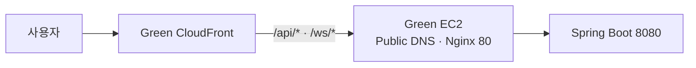
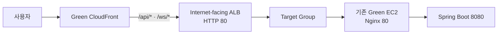

# AWS Green API ALB 추가 콘솔 가이드

이 문서는 현재 BuildGraph Green 구조에 Application Load Balancer(ALB)를 추가하고, 기존 Nginx를 유지한 채 CloudFront의 API·WebSocket origin을 ALB로 전환하는 절차를 설명한다.

작성 기준:

- 기준 일자: 2026-07-15
- AWS 계정: `443915990705`
- 리전: `ap-northeast-2` 서울
- 기준 상태: [aws-infrastructure-current-state-audit.md](aws-infrastructure-current-state-audit.md)
- 부하 테스트 계획: [부하테스트.md](부하테스트.md)

이 문서는 AWS Management Console 조작을 기준으로 한다. 실제 Secret, token, 비밀번호, CloudFront origin 검증 header 이름과 값은 문서·Git·채팅·스크린샷에 기록하지 않는다.

> **2026-07-15 작업 결정:** CloudFront origin 검증용 custom header와 ALB listener 기본 `403` 적용은 이번 전환에서 수행하지 않고 후속 작업으로 연기한다. 현재 단계에서는 ALB listener의 기본 Target Group forward를 유지한다. 이 상태는 CloudFront managed prefix list에 속한 다른 CloudFront Distribution까지 ALB에 접근할 수 있으므로 origin 보호가 완료된 상태가 아니다. 후속 작업 범위는 9번, 12.3, 13.1에 표시한다.

---

## 0. 이번 작업의 범위

### 0.1 변경 전



### 0.2 변경 후



### 0.3 이번 작업에서 하는 것

1. ALB용 Security Group을 생성한다.
2. 기존 Green EC2를 대상으로 하는 Target Group을 생성한다.
3. Public Subnet 2a·2b에 internet-facing ALB를 생성한다.
4. CloudFront `/api/*`와 `/ws/*` origin을 순서대로 ALB로 전환한다.
5. REST·인증·업로드·WebSocket을 검증한다.
6. 기존 EC2 origin으로 되돌리는 롤백 절차를 검증한다.

### 0.4 이번 작업에서 하지 않는 것

1. Nginx를 제거하지 않는다.
2. Spring Boot `8080`을 EC2 host나 인터넷에 공개하지 않는다.
3. Auto Scaling Group을 생성하지 않는다.
4. EC2를 추가 생성하지 않는다.
5. RDS·Redis·RabbitMQ·XGB 구성을 바꾸지 않는다.
6. Green EIP를 해제하지 않는다.
7. Blue EC2와 Blue CloudFront를 변경하지 않는다.
8. CloudFront 기본 S3 behavior를 변경하지 않는다.
9. Route 53 domain과 ACM 인증서를 새로 만들지 않는다.
10. CloudFront → ALB 구간을 이번 작업에서 HTTPS로 전환하지 않는다.
11. CloudFront origin 검증용 custom header와 ALB listener 기본 `403`을 이번 작업에서 적용하지 않는다. 9번 절차로 후속 진행한다.

> ALB만 추가하고 Target이 기존 EC2 한 대뿐이므로 이번 단계만으로 처리 용량이나 애플리케이션 가용성이 증가하지는 않는다. 이번 작업의 목적은 안정적인 CloudFront origin과 향후 ASG 연결 지점을 만드는 것이다.

---

## 1. 현재 확정값

| 항목 | 현재 값 |
| --- | --- |
| VPC | `buildgraph-demo-vpc` / `vpc-06c90b864a62f93a4` |
| Public Subnet 2a | `subnet-0b48bd72162060261` / `10.0.0.0/20` |
| Public Subnet 2b | `subnet-0db73cf18a85ea8f1` / `10.0.16.0/20` |
| Public route table | `rtb-05bef98dcdf339683` |
| Internet Gateway | `igw-0eeddf412eaad84c9` |
| Green EC2 | `buildgraph-demo-api-green-ec2` |
| Green Instance ID | `i-033105106a7970ac1` |
| Green AZ | `ap-northeast-2b` |
| Green private IP | `10.0.23.7` |
| Green EIP | `43.203.33.190` |
| Green Public DNS | `ec2-43-203-33-190.ap-northeast-2.compute.amazonaws.com` |
| 기존 EC2 SG | `buildgraph-demo-ec2-sg` / `sg-099aac782b77a854e` |
| Green CloudFront | `E1MVNMU0O781IM` |
| Green CloudFront domain | `d2qhd7deuwmlln.cloudfront.net` |
| 기존 Green API origin | Green EC2 Public DNS / HTTP `80` |
| Nginx host port | HTTP `80` |
| Spring Boot container port | `8080`, host 비공개 |
| API health | `/api/health`, DB probe 포함 |
| Nginx liveness | `/healthz`, Nginx만 확인 |

신규 리소스 이름은 다음으로 고정한다.

| 리소스 | 신규 이름 |
| --- | --- |
| ALB Security Group | `buildgraph-demo-alb-green-sg` |
| Target Group | `buildgraph-demo-api-green-tg` |
| ALB | `buildgraph-demo-api-green-alb` |
| CloudFront ALB origin ID | `buildgraph-demo-api-green-alb-origin` |

실제 생성 과정에서 이름 충돌이나 AWS 제약이 발생하면 임의로 다른 이름을 쓰지 말고 사용할 이름을 확정한 뒤 이 문서의 기록표에 남긴다.

---

## 2. 핵심 설계 결정

### 2.1 Nginx는 유지한다

현재 [infra/nginx/api.conf](../infra/nginx/api.conf)는 다음을 담당한다.

- `/api/*` → Spring Boot `8080` proxy
- `/ws/*` WebSocket Upgrade
- `X-Forwarded-For`, `X-Forwarded-Proto`, `X-Forwarded-Host` 전달
- API read/send timeout `300초`
- WebSocket read/send timeout `3600초`
- 업로드 상한 `50m`

따라서 이번 구조는 `ALB → Nginx → Spring Boot`다. ALB가 Nginx를 대체하지 않는다.

### 2.2 ALB는 internet-facing으로 만든다

현재 CloudFront는 VPC origin을 사용하지 않고 public custom origin을 사용한다. 최소 변경을 위해 ALB도 internet-facing으로 생성하고 Public 2a·2b Subnet을 선택한다.

ALB는 서로 다른 AZ의 Subnet을 최소 두 개 요구한다. 각 Subnet은 최소 `/27` 크기와 사용 가능한 IP 8개 이상을 확보해야 한다. 현재 두 Public Subnet은 `/20`이지만 생성 직전에 Available IPv4 수를 다시 확인한다.

### 2.3 Target은 기존 Green EC2 한 대다

Target type은 `Instances`, protocol은 `HTTP`, port는 `80`을 사용한다. ALB는 EC2의 private IP로 Nginx `80`에 연결한다.

Target Group의 protocol version은 `HTTP1`을 사용한다. WebSocket은 최초 HTTP/1.1 Upgrade 이후 연결된 Target에 유지된다.

### 2.4 Health check는 `/api/health`를 사용한다

`/healthz`는 Nginx 프로세스만 확인하고 API·DB 장애를 감지하지 못한다. 이번 Target Group은 DB probe를 포함하는 `/api/health`를 readiness 기준으로 사용한다.

단, 향후 ASG를 적용할 때는 공유 RDS 장애가 모든 EC2 교체로 이어지지 않도록 liveness와 readiness를 분리해서 다시 설계해야 한다.

### 2.5 기존 EC2 origin은 삭제하지 않는다

CloudFront에 ALB origin을 새로 추가하고 기존 EC2 origin을 그대로 보존한다. 장애가 발생하면 `/api/*`와 `/ws/*` behavior의 Target origin만 기존 EC2로 되돌린다.

### 2.6 origin 구간 TLS는 후속 작업이다

현재 CloudFront → Green EC2도 HTTP `80`이며 Green CloudFront에는 alternate domain이 없다. 이번 작업은 동일한 통신 조건을 유지해 CloudFront → ALB도 HTTP `80`으로 구성한다.

CloudFront → ALB를 HTTPS로 바꾸려면 다음이 추가로 필요하다.

- 사용자가 소유한 origin domain
- 서울 리전 ALB용 ACM 인증서
- ALB HTTPS `443` listener
- CloudFront origin protocol `HTTPS only`
- 필요하면 viewer용 `us-east-1` ACM 인증서

이번 HTTP 구성에서는 CloudFront managed prefix list만 네트워크 경계로 먼저 사용한다. custom header와 listener 기본 `403`은 후속 작업으로 연기했으며, 적용 전에는 다른 CloudFront Distribution의 요청을 우리 Distribution과 구분하지 못한다. AWS는 custom header의 기밀성을 위해 origin HTTPS를 권장하므로 이번 구성을 최종 보안 완료 상태로 간주하지 않는다.

### 2.7 origin 검증 header는 후속 작업으로 연기한다

현재 적용 상태는 다음과 같다.

```text
ALB SG inbound: CloudFront origin-facing prefix list
ALB listener default: Target Group forward
CloudFront ALB origin custom header: 없음
```

이 구성은 일반 인터넷의 직접 접근은 ALB SG에서 차단하지만, AWS CloudFront origin-facing 대역을 사용하는 다른 Distribution까지 구분하지는 못한다. 이번 전환에서는 이 제한을 명시적으로 수용하고, 9번의 custom header·listener 기본 `403` 작업을 별도 변경으로 수행한다.

후속 작업이 끝나기 전 준수사항:

- ALB SG를 `0.0.0.0/0`으로 열지 않는다.
- 작업자 public IPv4 `/32`는 ALB 직접 검증 직후 삭제한다.
- 기존 애플리케이션 인증·권한 검증을 유지한다.
- origin 보호 완료로 표시하지 않는다.

---

## 3. 시작 전 하드 게이트

다음 조건이 모두 통과해야 ALB를 생성한다.

- [ ] AWS 계정이 `443915990705`다.
- [ ] 리전이 `ap-northeast-2` 서울이다.
- [ ] Green EC2 `i-033105106a7970ac1`이 Running이다.
- [ ] EC2 system/instance status check가 모두 통과한다.
- [ ] Green CloudFront `E1MVNMU0O781IM`이 Enabled·Deployed다.
- [ ] `https://d2qhd7deuwmlln.cloudfront.net/api/health`가 `200`이다.
- [ ] `/api/health` 응답이 `status: UP`, `database: UP`이다.
- [ ] Nginx·API·XGB 컨테이너가 모두 정상이다.
- [ ] 실행 중인 API/XGB image digest가 배포 manifest와 일치한다.
- [ ] API rollback drill 또는 직전 정상 image 재배포 경로를 확인했다.
- [ ] Public 2a·2b Subnet이 `0.0.0.0/0 → IGW` route를 사용한다.
- [ ] Public 2a·2b 각각 Available IPv4가 8개 이상이다.
- [ ] EC2 Security Group rule quota가 CloudFront prefix list weight를 수용한다.
- [ ] 전환 중 CloudFront·EC2·Nginx 배포를 중지할 담당자가 정해졌다.
- [ ] 장애 시 CloudFront behavior를 되돌릴 담당자가 정해졌다.

하나라도 확인하지 못하면 Target Group과 ALB 생성 전 단계에서 중단한다.

---

## 4. 이번 단계에서 절대 하지 않는 작업

1. 기존 `buildgraph-demo-ec2-sg`의 TCP `80` `0.0.0.0/0` 규칙을 삭제하지 않는다.
2. 기존 SG의 TCP `22` 규칙을 이번 작업과 함께 변경하지 않는다.
3. 기존 SG가 Blue와 Green에 공유된 사실을 무시하지 않는다.
4. Green EC2의 EIP나 Public DNS를 변경하지 않는다.
5. 기존 CloudFront EC2 origin을 삭제하거나 덮어쓰지 않는다.
6. CloudFront `Default (*)` S3 behavior를 변경하지 않는다.
7. `/api/*` 또는 `/ws/*`에 정적 cache policy를 적용하지 않는다.
8. ALB가 Healthy가 되기 전에 CloudFront behavior를 변경하지 않는다.
9. `/api/*`와 `/ws/*`를 한 번에 전환하지 않는다.
10. Target type을 임의로 `IP addresses`로 바꾸지 않는다.
11. API `8080` 또는 XGB `8091`을 ALB Target으로 직접 공개하지 않는다.
12. ALB SG의 작업자 public IPv4 `/32` rule을 직접 검증 후 남겨두지 않는다.
13. 후속 작업에서 생성할 origin 검증 header 이름이나 값을 문서·Git·채팅·스크린샷에 기록하지 않는다.
14. 후속 작업 이후 `aws cloudfront get-distribution-config` 전체 결과를 저장하거나 공유하지 않는다. custom origin header 값이 포함될 수 있다.
15. 후속 작업 이후 ALB listener rule 전체 JSON을 저장하거나 공유하지 않는다. header 값이 포함될 수 있다.
16. 전환 검증이 끝나기 전에 ALB·Target Group·기존 origin을 삭제하지 않는다.

---

## 5. 변경 전 기준선 기록

### 5.1 CloudFront 현재 설정

1. AWS Console에서 CloudFront를 연다.
2. `E1MVNMU0O781IM`을 선택한다.
3. `Origins`에서 기존 Green EC2 origin을 연다.
4. 다음 값만 기록한다.
   - Origin ID
   - Origin domain
   - Origin protocol policy
   - HTTP port
   - Origin response timeout
5. `Behaviors`에서 다음을 기록한다.
   - `/api/*` Target origin
   - `/ws/*` Target origin
   - Allowed methods
   - Cache policy
   - Origin request policy
   - Viewer protocol policy
6. origin custom header 값이 보이는 화면은 캡처하지 않는다.

현재 감사 문서 기준 예상값:

| Behavior | Origin | Cache | Origin request |
| --- | --- | --- | --- |
| `/api/*` | Green EC2 | `CachingDisabled` | `AllViewer` |
| `/ws/*` | Green EC2 | `CachingDisabled` | `AllViewer` |

실제 Console 값이 다르면 이 문서를 그대로 진행하지 말고 차이를 먼저 확인한다.

### 5.2 API 기준선

로컬 터미널에서 실행한다.

```bash
curl -i https://d2qhd7deuwmlln.cloudfront.net/api/health
```

기록:

- HTTP status
- 전체 응답시간
- 응답 body의 `status`와 `database`
- 실행 시각

로그인, refresh, 부품 조회, 견적 저장, WebSocket도 각각 1회 확인한다. 실제 token과 응답 개인정보는 기록하지 않는다.

### 5.3 롤백 기준

다음을 기록표에 남긴다.

- 기존 EC2 origin ID
- 기존 EC2 origin domain
- `/api/*`의 기존 Target origin
- `/ws/*`의 기존 Target origin
- 전환 전 CloudFront Last modified time
- 전환 담당자와 롤백 담당자

---

## 6. ALB Security Group 생성

### 6.1 CloudFront managed prefix list 확인

1. VPC Console을 연다.
2. 왼쪽에서 `Managed prefix lists`를 연다.
3. Owner가 AWS인 다음 항목을 찾는다.

```text
com.amazonaws.global.cloudfront.origin-facing
```

4. IPv4 prefix list ID를 기록한다.
5. Weight가 `55`인지 확인한다.

이 prefix list는 Security Group rule quota에서 55개 규칙으로 계산된다. 기본 quota가 부족하면 우회해서 `0.0.0.0/0`을 사용하지 말고 quota를 먼저 확인한다.

### 6.2 Security Group 생성

1. EC2 Console을 연다.
2. `Security Groups`를 연다.
3. `Create security group`을 누른다.
4. 다음 값을 입력한다.

| 항목 | 값 |
| --- | --- |
| Name | `buildgraph-demo-alb-green-sg` |
| Description | `CloudFront to BuildGraph Green ALB` |
| VPC | `vpc-06c90b864a62f93a4` |

Inbound rule:

| Type | Protocol | Port | Source |
| --- | --- | ---: | --- |
| HTTP | TCP | 80 | `com.amazonaws.global.cloudfront.origin-facing` |

Outbound rule:

| Type | Protocol | Port | Destination |
| --- | --- | ---: | --- |
| HTTP | TCP | 80 | `buildgraph-demo-ec2-sg` / `sg-099aac782b77a854e` |

5. Tag를 추가한다.

| Key | Value |
| --- | --- |
| `Name` | `buildgraph-demo-alb-green-sg` |
| `Stack` | `green` |
| `Service` | `api` |

6. 생성한 SG ID를 기록한다.

### 6.3 임시 검증 rule

ALB DNS로 직접 검증하는 동안에만 현재 작업자 public IPv4 `/32`를 TCP `80`에 임시 허용한다.

| Type | Port | Source |
| --- | ---: | --- |
| HTTP | 80 | `작업자 현재 Public IPv4/32` |

`0.0.0.0/0`은 사용하지 않는다. ALB 직접 검증이 끝나면 이 rule을 반드시 삭제한다.

### 6.4 기존 EC2 SG에 ALB source rule 추가

현재 기존 EC2 SG에는 TCP `80` `0.0.0.0/0`가 있어 ALB 연결이 이미 가능하지만, 향후 Green SG 분리를 위해 명시적 rule을 추가한다.

| Type | Port | Source |
| --- | ---: | --- |
| HTTP | 80 | `buildgraph-demo-alb-green-sg` |

기존 `0.0.0.0/0` TCP `80`와 SSH `22` rule은 이 단계에서 삭제하지 않는다. 이 SG는 Blue와 Green이 함께 사용한다.

---

## 7. Target Group 생성

1. EC2 Console 왼쪽 `Target Groups`를 연다.
2. `Create target group`을 누른다.
3. 다음 값을 입력한다.

| 항목 | 값 |
| --- | --- |
| Target type | `Instances` |
| Target group name | `buildgraph-demo-api-green-tg` |
| Protocol | `HTTP` |
| Port | `80` |
| IP address type | `IPv4` |
| Protocol version | `HTTP1` |
| VPC | `vpc-06c90b864a62f93a4` |

### 7.1 Health check

| 항목 | 값 |
| --- | --- |
| Health check protocol | `HTTP` |
| Health check path | `/api/health` |
| Success codes | `200` |
| Port | Traffic port |
| Interval | `30초` |
| Timeout | `5초` |
| Healthy threshold | `2` |
| Unhealthy threshold | `2` |

`/healthz`를 사용하지 않는다. `/api/health`는 DB 연결 실패 시 `503`을 반환하도록 계약돼 있다.

### 7.2 Target 등록

1. `Register targets` 단계에서 `i-033105106a7970ac1`을 선택한다.
2. Port가 `80`인지 확인한다.
3. `Include as pending below`를 누른다.
4. pending target 목록에 Green 한 대만 있는지 확인한다.
5. `Create target group`을 누른다.

Blue `i-082c21a20e14f3295`를 등록하지 않는다.

---

## 8. ALB 생성

1. EC2 Console 왼쪽 `Load Balancers`를 연다.
2. `Create load balancer`를 누른다.
3. `Application Load Balancer`를 선택한다.
4. 다음 값을 입력한다.

| 항목 | 값 |
| --- | --- |
| Load balancer name | `buildgraph-demo-api-green-alb` |
| Scheme | `Internet-facing` |
| IP address type | `IPv4` |
| VPC | `vpc-06c90b864a62f93a4` |

Network mapping:

| AZ | Subnet |
| --- | --- |
| `ap-northeast-2a` | `subnet-0b48bd72162060261` |
| `ap-northeast-2b` | `subnet-0db73cf18a85ea8f1` |

Security Group:

```text
buildgraph-demo-alb-green-sg
```

기본 VPC SG나 기존 EC2 SG를 ALB에 추가하지 않는다.

Listener and routing:

| Protocol | Port | 임시 Default action |
| --- | ---: | --- |
| HTTP | 80 | `buildgraph-demo-api-green-tg` |

5. 다음 Tag를 추가한다.

| Key | Value |
| --- | --- |
| `Name` | `buildgraph-demo-api-green-alb` |
| `Stack` | `green` |
| `Service` | `api` |

6. Summary에서 VPC, Subnet 두 개, SG, Target Group을 다시 확인한다.
7. `Create load balancer`를 누른다.
8. 상태가 `Active`가 될 때까지 기다린다.
9. ALB DNS name과 ARN을 기록한다.

ALB 생성 직후 listener default action은 Target Group forward 상태다. 2026-07-15 결정에 따라 9번의 custom header·기본 `403` 작업은 후속으로 연기하고 이번 전환에서는 이 상태를 유지한다. CloudFront 연결 전 ALB SG가 CloudFront prefix list와 작업자 `/32`만 허용하는지 확인하고, 12번 직접 검증이 끝나면 작업자 `/32`를 삭제한다.

---

## 9. [후속 작업] CloudFront origin 검증 header 준비

> **현재 상태: 연기·미적용.** 이번 ALB 전환에서는 이 절차를 실행하지 않는다. 현재 listener 기본 action은 Target Group forward이며 CloudFront ALB origin에도 custom header를 추가하지 않는다. 이 절차는 다른 CloudFront Distribution의 우회 접근을 차단하기 위한 별도 보안 작업으로 반드시 추적한다.

AWS 공식 가이드는 internet-facing ALB를 CloudFront origin으로 사용할 때 다음을 권장한다.

1. CloudFront가 origin request에 임의의 custom header를 추가한다.
2. ALB listener가 해당 header가 있는 요청만 Target Group으로 전달한다.
3. 나머지 요청에는 고정 `403`을 반환한다.

### 9.1 header 생성 원칙

- header 이름과 값을 모두 충분히 긴 무작위 값으로 생성한다.
- header 이름은 `X-Amz-`, `X-Edge-`로 시작하지 않는다.
- 비밀번호 관리자에만 저장한다.
- 문서, GitHub Secret, 일반 메모, 채팅에 복사하지 않는다.
- Console 캡처에 노출하지 않는다.
- 애플리케이션 전체 request header 로그를 활성화하지 않는다.

실제 이름과 값은 이 문서에 쓰지 않는다.

### 9.2 ALB listener rule 변경

1. EC2 Console에서 `buildgraph-demo-api-green-alb`를 연다.
2. `Listeners and rules`에서 HTTP `80` listener를 연다.
3. `Manage rules`를 누른다.
4. Priority `10` rule을 추가한다.
5. Condition은 `HTTP header`를 선택한다.
6. 비밀번호 관리자에 저장한 header 이름과 값을 입력한다.
7. Action은 `Forward to target groups`를 선택한다.
8. `buildgraph-demo-api-green-tg`를 선택한다.
9. 저장한다.
10. Default rule을 편집한다.
11. 기존 forward action을 삭제한다.
12. `Return fixed response`를 선택한다.

| 항목 | 값 |
| --- | --- |
| Response code | `403` |
| Content type | `text/plain` |
| Response body | `Access denied` |

13. 최종 rule이 다음 구조인지 확인한다.

```text
Priority 10: 지정 HTTP header 일치 → Target Group forward
Default: 403 Access denied
```

listener rule을 출력하는 CLI 결과에는 검증 값이 포함될 수 있으므로 전체 출력을 저장하거나 공유하지 않는다.

---

## 10. ALB attribute 설정

### 10.1 Idle timeout

1. ALB 상세 화면에서 `Attributes`를 연다.
2. `Edit`을 누른다.
3. `Connection idle timeout`을 `3600초`로 설정한다.
4. 저장한다.

ALB 기본 idle timeout은 60초다. 현재 Nginx WebSocket timeout이 3600초이므로 ALB도 3600초로 맞춘다. WebSocket client는 연결 유지를 위해 application-level ping/pong 또는 실제 data frame을 주기적으로 보내야 한다.

HTTP/2 PING frame만으로는 ALB idle timeout이 초기화되지 않는다.

### 10.2 Cross-zone

ALB cross-zone load balancing은 기본 활성이다. 기존 Target이 `ap-northeast-2b` 한 대뿐이므로 비활성화하지 않는다.

### 10.3 Deletion protection

전환과 롤백 검증이 모두 끝난 뒤 ALB deletion protection을 활성화한다. 작업 중 실수로 삭제되지 않게 하되, 초기 구성 오류로 재생성이 필요한 시점에는 전환 담당자와 상태를 확인한 뒤 결정한다.

### 10.4 Access log

이번 작업에서는 신규 로그용 S3 bucket과 bucket policy를 임의로 만들지 않는다. 기존 승인된 ALB 로그 bucket이 있다면 별도 합의 후 access log를 활성화한다.

---

## 11. Target health 확인

1. `Target Groups`에서 `buildgraph-demo-api-green-tg`를 연다.
2. `Targets` 탭을 연다.
3. `i-033105106a7970ac1`이 `Healthy`인지 확인한다.
4. Health check path가 `/api/health`인지 다시 확인한다.

Unhealthy라면 CloudFront 작업으로 넘어가지 않는다.

### 11.1 Unhealthy 점검 순서

1. Green EC2가 Running인지 확인한다.
2. ALB와 Target Group VPC가 `vpc-06c90b864a62f93a4`인지 확인한다.
3. ALB가 Public 2a·2b를 사용하고 있는지 확인한다.
4. Target port가 `80`인지 확인한다.
5. ALB SG outbound TCP `80` destination이 기존 EC2 SG인지 확인한다.
6. 기존 EC2 SG inbound에 ALB SG source TCP `80`가 있는지 확인한다.
7. Nginx 컨테이너가 host `80`을 listen하는지 확인한다.
8. `/api/health`가 EC2 내부에서 `200`인지 확인한다.
9. RDS 상태와 DB 연결을 확인한다.
10. Target health reason을 확인한다.

`/healthz`로 바꿔 억지로 Healthy를 만들지 않는다.

---

## 12. ALB 직접 검증

6.3에서 작업자 IP `/32`를 임시 허용한 상태에서 실행한다.

현재 단계에서는 custom header가 없고 listener 기본 action이 Target Group forward다. ALB DNS만 변수로 입력한다.

```bash
read -r ALB_DNS
```

### 12.1 현재 단계 health 요청

```bash
curl -i "http://${ALB_DNS}/api/health"
```

통과 기준:

- HTTP `200`
- `status: UP`
- `database: UP`

### 12.2 현재 단계 존재하지 않는 API

```bash
curl -i "http://${ALB_DNS}/api/__alb-not-found-check"
```

API 계약에 따른 `404`가 반환돼야 한다. S3 `index.html`이 반환되면 안 된다.

### 12.3 [후속 작업] custom header 적용 후 검증

9번과 13.1을 적용하는 후속 변경에서만 실행한다. shell history에 header 값을 직접 쓰지 않기 위해 변수로 입력한다.

```bash
read -r ORIGIN_VERIFY_HEADER
read -rs ORIGIN_VERIFY_VALUE
echo
```

header가 없는 요청:

```bash
curl -i "http://${ALB_DNS}/api/health"
```

통과 기준:

```text
HTTP 403
Access denied
```

header가 있는 요청:

```bash
curl -i \
  -H "${ORIGIN_VERIFY_HEADER}: ${ORIGIN_VERIFY_VALUE}" \
  "http://${ALB_DNS}/api/health"
```

통과 기준은 HTTP `200`, `status: UP`, `database: UP`이다.

검증을 마친 뒤 메모리의 변수를 제거한다.

```bash
unset ALB_DNS ORIGIN_VERIFY_VALUE ORIGIN_VERIFY_HEADER
```

현재 단계의 ALB 직접 검증이 끝나면 작업자 IP `/32` 임시 rule을 즉시 삭제한다. CloudFront 전환 완료까지 유지하지 않는다.

---

## 13. Green CloudFront에 ALB origin 추가

1. CloudFront Console을 연다.
2. Distribution `E1MVNMU0O781IM`을 선택한다.
3. `Origins` 탭을 연다.
4. `Create origin`을 누른다.
5. 다음 값을 입력한다.

| 항목 | 값 |
| --- | --- |
| Origin domain | 생성한 ALB DNS name |
| Protocol | `HTTP only` |
| HTTP port | `80` |
| Origin path | 비움 |
| Name/Origin ID | `buildgraph-demo-api-green-alb-origin` |
| Origin response timeout | `120초` |

현재 EC2 origin의 response timeout이 120초이므로 동일하게 유지한다. Connection attempts와 connection timeout은 기존 EC2 origin 또는 현재 Console 기본값과 비교해 임의로 공격적으로 줄이지 않는다.

### 13.1 [후속 작업] Origin custom header

> **현재 상태: 연기·미적용.** 이번 ALB origin 생성 화면에서는 `Add custom header`를 누르지 않고 header 없이 저장한다. 9번을 수행하는 후속 변경에서 이 origin을 다시 편집해 추가한다.

`Add custom header`를 누르고 9번에서 비밀번호 관리자에 저장한 동일한 header 이름과 값을 입력한다.

주의:

- viewer가 같은 header를 보내도 CloudFront가 설정값으로 덮어쓴다.
- header 값이 보이는 상태로 화면을 캡처하지 않는다.
- CloudFront 배포 config 전체를 CLI로 출력하지 않는다.
- 이번 HTTP origin에서는 header 자체만을 유일한 보안 경계로 간주하지 않는다.

6. 저장한다.
7. Distribution이 `Deployed`가 될 때까지 기다린다.
8. 아직 `/api/*`와 `/ws/*` behavior는 기존 EC2 origin을 사용해야 한다.

origin 추가만으로 사용자 트래픽 경로는 바뀌지 않는다.

---

## 14. `/api/*`를 ALB로 전환

> **보안 예외 확인:** 9번과 13.1이 연기되어 현재 ALB listener는 기본 forward이고 CloudFront ALB origin에는 custom header가 없다. 따라서 이번 전환은 origin 보호 미완료 상태로 진행한다. 작업자 `/32` rule이 삭제됐고 ALB SG에 `0.0.0.0/0`가 없는지 먼저 확인하며, 후속 보안 작업을 별도로 추적한다.

1. Green CloudFront `Behaviors`를 연다.
2. `/api/*`를 선택하고 `Edit`을 누른다.
3. `Origin and origin groups`만 ALB origin으로 바꾼다.

```text
buildgraph-demo-api-green-alb-origin
```

4. 다음 설정은 변경하지 않는다.

| 항목 | 유지값 |
| --- | --- |
| Allowed methods | GET, HEAD, OPTIONS, PUT, POST, PATCH, DELETE |
| Cache policy | `CachingDisabled` |
| Origin request policy | `AllViewer` |
| Viewer protocol policy | HTTP → HTTPS Redirect |

5. 저장한다.
6. Distribution 상태가 `Deployed`가 될 때까지 기다린다.
7. CloudFront invalidation은 실행하지 않는다. API behavior는 캐시 비활성이다.

### 14.1 API smoke test

```bash
curl -i https://d2qhd7deuwmlln.cloudfront.net/api/health
```

다음 기능을 순서대로 검증한다.

- [ ] `/api/health` `200`
- [ ] 로그인
- [ ] access token 사용
- [ ] refresh token 갱신
- [ ] 로그아웃
- [ ] 부품 목록과 pagination
- [ ] 견적 draft 생성
- [ ] Tool API 1개 이상
- [ ] 견적 저장과 이력 조회
- [ ] 존재하지 않는 API가 계약상 `404`
- [ ] Google OAuth callback/redirect
- [ ] CORS origin
- [ ] 파일 업로드 기능이 있다면 허용 크기 내 업로드

확인할 CloudWatch/ALB metric:

- `RequestCount`
- `TargetResponseTime`
- `HTTPCode_ELB_4XX_Count`
- `HTTPCode_ELB_5XX_Count`
- `HTTPCode_Target_4XX_Count`
- `HTTPCode_Target_5XX_Count`
- `HealthyHostCount`
- `UnHealthyHostCount`

`HTTPCode_ELB_5XX`와 `HTTPCode_Target_5XX`를 구분한다. 전자는 ALB 계층, 후자는 Nginx/API Target 응답이다.

API smoke가 실패하면 `/ws/*`를 전환하지 말고 18번 롤백을 수행한다.

---

## 15. `/ws/*`를 ALB로 전환

API smoke가 모두 통과한 경우에만 진행한다.

1. Green CloudFront `Behaviors`를 연다.
2. `/ws/*`를 선택하고 `Edit`을 누른다.
3. Target origin을 ALB origin으로 변경한다.
4. 다음 설정을 유지한다.

| 항목 | 유지값 |
| --- | --- |
| Allowed methods | GET, HEAD, OPTIONS |
| Cache policy | `CachingDisabled` |
| Origin request policy | `AllViewer` |
| Viewer protocol policy | HTTP → HTTPS Redirect |

`AllViewer`는 WebSocket handshake에 필요한 viewer header를 origin으로 전달한다. CloudFront WebSocket은 HTTP/1.1 Upgrade를 사용한다.

5. 저장한다.
6. Distribution이 `Deployed`가 될 때까지 기다린다.

### 15.1 WebSocket 검증

브라우저 개발자 도구의 `Network → WS`에서 확인한다.

- [ ] `wss://d2qhd7deuwmlln.cloudfront.net/ws/support-chat...` 연결
- [ ] HTTP `101 Switching Protocols`
- [ ] 연결 후 5초 안에 ticket AUTH frame 처리
- [ ] `CHAT_UPDATED` 또는 해당 화면의 정상 push
- [ ] 관리자 queue WebSocket 연결
- [ ] PC Agent diagnosis WebSocket 연결
- [ ] 연결이 65초를 넘어도 유지됨
- [ ] application-level ping/pong 또는 실제 frame 동작
- [ ] 연결 종료 후 정상 재연결
- [ ] 실패 시 REST polling fallback

CloudFront와 ALB를 통과한 WebSocket이 101만 반환하고 실제 frame 송수신에 실패할 수 있으므로 handshake만으로 PASS 처리하지 않는다.

---

## 16. 전환 후 보안 정리

### 16.1 작업자 IP 임시 rule 삭제

ALB SG에서 6.3의 작업자 public IPv4 `/32` TCP `80` rule을 삭제한다.

삭제 후 확인:

1. 작업자 PC에서 ALB DNS 직접 요청은 timeout 또는 연결 차단돼야 한다.
2. CloudFront `/api/health`는 계속 `200`이어야 한다.
3. ALB `HealthyHostCount`는 계속 1이어야 한다.

### 16.2 현재 listener 상태와 후속 `403`

이번 전환 단계에서는 다음 상태를 확인한다.

```text
Default → Target Group forward
Custom header rule → 없음
```

이는 2026-07-15 연기 결정에 따른 임시 상태다. 9번과 13.1의 후속 작업을 수행한 뒤에만 다음 상태로 바꾼다.

```text
Header match → Target Group
Default → 403
```

### 16.3 WAF 확인

Green CloudFront의 기존 WAF association은 유지한다. 이번 작업에서 ALB에 두 번째 WAF를 임의로 연결하지 않는다.

현재 Green WAF rule은 Count 모드이므로 ALB 추가가 WAF 차단 활성화를 의미하지 않는다.

---

## 17. 전환 완료 검증

다음 항목을 한 번의 검증 실행으로 기록한다.

### 17.1 경로

- [ ] CloudFront Default `*` → 기존 Private S3
- [ ] CloudFront `/api/*` → ALB
- [ ] CloudFront `/ws/*` → ALB
- [ ] ALB → Target Group
- [ ] Target Group → Green EC2 Nginx `80`
- [ ] Nginx → Spring Boot `8080`

### 17.2 상태

- [ ] ALB `Active`
- [ ] Target `Healthy`
- [ ] Green EC2 status check PASS
- [ ] Nginx/API/XGB 컨테이너 정상
- [ ] RDS/Redis/RabbitMQ 정상
- [ ] CloudFront `Deployed`
- [ ] 기존 EC2 origin 보존
- [ ] Blue EC2·CloudFront 무변경

### 17.3 기능

- [ ] health
- [ ] 인증/refresh/logout
- [ ] 부품 조회
- [ ] 견적 생성·저장·이력
- [ ] Tool
- [ ] 업로드
- [ ] WebSocket AUTH·push·재연결
- [ ] OAuth redirect
- [ ] API 404가 SPA `index.html`로 바뀌지 않음

### 17.4 관측

- [ ] `RequestCount` 증가
- [ ] `HealthyHostCount = 1`
- [ ] `UnHealthyHostCount = 0`
- [ ] 예상하지 않은 ALB 5xx 없음
- [ ] 예상하지 않은 Target 5xx 없음
- [ ] 전환 전 대비 응답시간 급증 없음

---

## 18. 롤백

### 18.1 즉시 롤백 조건

다음 중 하나라도 발생하면 높은 부하를 보내지 않고 롤백한다.

- `/api/health` 연속 실패
- Target `Unhealthy`
- CloudFront `502` 또는 `503` 지속
- 로그인·refresh 실패
- 정상 API 4xx/5xx 급증
- OAuth callback 또는 CORS 실패
- 업로드 실패
- WebSocket 101 실패
- WebSocket frame 송수신 또는 재연결 실패
- CloudFront 배포 후 API 404가 SPA로 변환
- ALB response time이 기준선보다 비정상적으로 증가

### 18.2 `/ws/*`만 실패하는 경우

1. CloudFront `E1MVNMU0O781IM`의 `Behaviors`를 연다.
2. `/ws/*`를 편집한다.
3. Target origin을 기존 Green EC2 origin으로 되돌린다.
4. 다른 설정은 변경하지 않는다.
5. 저장하고 `Deployed`까지 기다린다.
6. WebSocket AUTH·frame·재연결을 다시 확인한다.
7. `/api/*`는 ALB를 유지할 수 있다.

### 18.3 공통 API/ALB 장애인 경우

1. 기존 EC2 origin이 CloudFront에서 삭제되지 않았는지 확인한다.
2. 기존 공유 EC2 SG가 Green에 계속 연결돼 있는지 확인한다.
3. `/api/*` behavior를 기존 Green EC2 origin으로 되돌린다.
4. `/ws/*` behavior도 기존 Green EC2 origin으로 되돌린다.
5. Cache policy, Origin request policy, allowed methods는 변경하지 않는다.
6. 저장하고 Distribution이 `Deployed`가 될 때까지 기다린다.
7. 다음을 확인한다.

```bash
curl -i https://d2qhd7deuwmlln.cloudfront.net/api/health
```

8. 로그인·refresh·부품 조회·견적 저장·WebSocket을 재확인한다.
9. ALB, Target Group, ALB SG는 즉시 삭제하지 않는다.
10. 장애 시각, CloudFront 상태, Target health reason, ALB/Target 5xx를 기록한다.

### 18.4 롤백 후 정리

- ALB SG 작업자 IP 임시 rule이 남아 있으면 삭제한다.
- 현재 listener 기본 forward와 custom header 미적용 상태를 작업 기록에 남긴다.
- 9번 후속 작업을 이미 적용한 시점의 롤백이라면 listener 기본 `403`과 비밀번호 관리자의 custom header를 유지한다.
- 원인을 해결하기 전 CloudFront를 다시 ALB로 전환하지 않는다.
- 롤백 성공 후에만 ALB 재검증 계획을 세운다.

---

## 19. 롤백 대기 종료 후 Green SG 분리

현재 `buildgraph-demo-ec2-sg`는 Blue와 Green이 공유하며 TCP `80`·`22`가 `0.0.0.0/0`에 열려 있다. 이 SG의 규칙을 직접 닫으면 Blue까지 영향을 받는다.

ALB 전환과 롤백 검증이 끝난 뒤 Green 전용 SG를 별도 작업으로 만든다.

권장 목표:

```text
ALB SG
  inbound 80: CloudFront origin-facing prefix list
  outbound 80: Green EC2 SG

Green EC2 SG
  inbound 80: ALB SG
  롤백 대기 중에만 inbound 80: CloudFront prefix list
  outbound: 필요한 AWS·데이터 서비스

Blue EC2
  기존 공유 SG 유지
```

Green 전용 SG로 바꾸기 전에 다음 Data SG에도 Green SG source를 추가해야 한다.

- RDS TCP `5432`
- Redis TCP `6379`
- RabbitMQ TCP `5671`

전환 순서:

1. Green 전용 EC2 SG 생성
2. ALB SG source TCP `80` 추가
3. 롤백용 CloudFront prefix list source TCP `80` 임시 추가
4. Data SG 세 개에 Green SG source 추가
5. Green EC2에 새 SG를 기존 SG와 함께 연결
6. CloudFront API·WebSocket 재검증
7. Green EC2에서 기존 공유 SG만 제거
8. Blue EC2에는 기존 공유 SG가 계속 연결됐는지 확인
9. 롤백 대기 종료 후 Green SG의 직접 CloudFront prefix rule 제거
10. 기존 CloudFront EC2 origin 삭제 여부를 별도 승인 후 결정

이 SG 분리 작업은 이번 ALB 생성 성공과 동시에 수행하지 않는다. 먼저 CloudFront → ALB 경로와 롤백을 검증한다.

---

## 20. ALB 추가 후에도 남는 제한

### 20.1 Auto Scaling은 아직 없다

Target은 기존 EC2 한 대뿐이다. ALB는 요청을 전달하지만 EC2를 자동 생성하지 않는다.

후속 구조:

```text
CloudFront
→ ALB
→ Target Group
→ Auto Scaling Group
   ├─ EC2 1
   ├─ EC2 2
   └─ EC2 N
```

### 20.2 단일 Target 장애는 그대로다

ALB 자체는 두 AZ에 있지만 Target은 `ap-northeast-2b` 한 대다. EC2 또는 해당 AZ에 장애가 발생하면 정상 Target이 없다.

### 20.3 WebSocket 다중 인스턴스 준비가 안 됐다

[API_CONTRACT.md](API_CONTRACT.md)의 현재 계약상 Support Chat과 PC Agent WebSocket session map은 JVM 메모리 기반이다. ASG를 적용하기 전에 Redis Pub/Sub fan-out 또는 동등한 인스턴스 간 전달 구조가 필요하다.

### 20.4 EC2 로컬 volume이 남아 있다

[compose.api.ecr.prod.yaml](../compose.api.ecr.prod.yaml)의 `agent-log-data`와 `recommendation-models`는 EC2 로컬 Docker volume이다. ASG scale-in이나 instance replacement 전에 S3/EFS 또는 재생성 가능한 artifact 전략을 확정해야 한다.

### 20.5 Scheduled job이 중복될 수 있다

API 인스턴스가 늘어나면 가격 갱신과 intake scheduler가 인스턴스마다 실행될 수 있다. ASG 전에 분산 lock 또는 전용 Worker 분리가 필요하다.

### 20.6 DB connection budget이 필요하다

```text
ASG 최대 EC2 수 × 인스턴스당 Hikari maximum pool size
< RDS가 안전하게 처리할 수 있는 connection 수
```

현재 `db.t4g.small`의 connection·CPU credit·memory를 측정한 뒤 ASG 최대값을 정한다.

---

## 21. 부하 테스트 연결

ALB 전환이 완료되면 다음 순서로 [부하테스트.md](부하테스트.md)를 실행한다.

1. ALB 적용 전 단일 EC2 기준선 결과 보존
2. ALB 적용 후 동일한 5 VU Smoke
3. 동일한 RPS/VU로 ALB 추가에 따른 latency 변화 확인
4. ALB 5xx와 Target 5xx 분리
5. WebSocket 장기 연결 확인
6. ASG 적용 전에는 1,000 VU 확장 효과를 기대하지 않음

ALB만 추가한 상태에서 높은 부하를 보내면 기존 단일 EC2·RDS 병목은 그대로다. 이번 테스트의 목적은 ALB가 기능·지연·WebSocket을 깨뜨리지 않았는지 검증하는 것이다.

---

## 22. 비용 주의

ALB는 생성된 시간과 LCU 사용량에 따라 과금된다. Target Group 자체보다 ALB 시간, 연결, 처리 byte, rule 평가가 주요 비용이다.

- 검증용 ALB도 생성 즉시 과금된다.
- 롤백 후 원인 분석을 위해 유지하면 계속 과금된다.
- 삭제하려면 CloudFront behavior가 기존 EC2 origin으로 복구되고 `Deployed`된 것을 먼저 확인한다.
- 비용만 보고 Target Group·SG·ALB를 먼저 삭제하지 않는다.

최신 단가는 [AWS Elastic Load Balancing 요금](https://aws.amazon.com/elasticloadbalancing/pricing/)에서 서울 리전을 선택해 확인한다.

---

## 23. 실행 기록표

| 항목 | 기록 |
| --- | --- |
| 작업 시작 시각 / KST | |
| 작업 종료 시각 / KST | |
| 작업자 | |
| 배포 Git SHA | |
| 실제 API image digest | |
| 실제 XGB image digest | |
| 기존 EC2 origin ID | |
| ALB SG ID | |
| CloudFront prefix list ID | |
| Target Group ARN | |
| ALB ARN | |
| ALB DNS | |
| Green Target health | |
| `/api/*` 전환 시각 | |
| `/ws/*` 전환 시각 | |
| CloudFront Deployed 시각 | |
| 작업자 IP 임시 rule 삭제 | |
| custom header·listener `403` | 후속 작업으로 연기 / 현재 미적용 |
| API smoke 결과 | |
| WebSocket 결과 | |
| 롤백 drill 결과 | |
| CloudWatch 이상 여부 | |
| 장애·특이사항 | |

origin 검증 header 이름과 값은 이 표에 기록하지 않는다.

---

## 24. 최종 체크리스트

### 생성

- [ ] ALB 전용 SG 생성
- [ ] ALB SG inbound가 CloudFront prefix list로 제한됨
- [ ] ALB SG outbound가 EC2 SG TCP `80`으로 제한됨
- [ ] Target Group target type `Instances`
- [ ] Target protocol `HTTP1` / port `80`
- [ ] Health check `/api/health` / matcher `200`
- [ ] Green EC2 한 대만 Target 등록
- [ ] ALB Public 2a·2b 선택
- [ ] ALB `Active`
- [ ] Target `Healthy`

### listener·보안

- [ ] listener 기본 Target Group forward 상태 확인
- [ ] custom header·기본 `403` 미적용 예외를 작업 기록에 남김
- [ ] idle timeout `3600초`
- [ ] 작업자 IP 임시 rule 삭제
- [ ] ALB SG에 `0.0.0.0/0`가 없음

### CloudFront

- [ ] 기존 EC2 origin 보존
- [ ] ALB origin 신규 생성
- [ ] ALB origin HTTP `80`
- [ ] origin response timeout `120초`
- [ ] origin custom header 미적용 상태를 확인하고 후속 작업으로 기록
- [ ] `/api/*`만 먼저 전환
- [ ] API smoke PASS 후 `/ws/*` 전환
- [ ] Cache policy `CachingDisabled` 유지
- [ ] Origin request policy `AllViewer` 유지
- [ ] Default S3 behavior 무변경
- [ ] Green CloudFront `Deployed`

### 검증

- [ ] ALB direct without header health `200`
- [ ] ALB direct 존재하지 않는 API `404`
- [ ] CloudFront health `200`
- [ ] 인증·refresh·logout PASS
- [ ] 주요 API PASS
- [ ] 업로드 PASS
- [ ] WebSocket `101`
- [ ] WebSocket frame·재연결 PASS
- [ ] ALB 5xx 이상 없음
- [ ] Target 5xx 이상 없음
- [ ] Blue 무변경

### 후속 origin 보호

- [ ] 임의 custom header 이름·값 생성
- [ ] header는 비밀번호 관리자에만 저장
- [ ] CloudFront ALB origin에 custom header 설정
- [ ] header 일치 rule만 Target Group forward
- [ ] listener default rule을 `403`으로 변경
- [ ] ALB direct without header `403`
- [ ] ALB direct with header health `200`
- [ ] 전체 CloudFront config 또는 listener rule 출력 미보관

### 롤백

- [ ] 기존 EC2 origin ID 기록
- [ ] `/api/*` origin 복구 절차 확인
- [ ] `/ws/*` origin 복구 절차 확인
- [ ] 롤백 후 health·인증·WebSocket 확인
- [ ] 롤백 전 ALB 리소스를 삭제하지 않음
- [ ] 롤백 drill 결과 기록

---

## 25. 공식 참고 문서

- [Create an Application Load Balancer](https://docs.aws.amazon.com/elasticloadbalancing/latest/application/create-application-load-balancer.html)
- [Application Load Balancer subnets](https://docs.aws.amazon.com/elasticloadbalancing/latest/application/application-load-balancers.html)
- [Create an ALB Target Group](https://docs.aws.amazon.com/elasticloadbalancing/latest/application/create-target-group.html)
- [ALB Target Group health checks](https://docs.aws.amazon.com/elasticloadbalancing/latest/application/target-group-health-checks.html)
- [ALB attributes and idle timeout](https://docs.aws.amazon.com/elasticloadbalancing/latest/application/edit-load-balancer-attributes.html)
- [ALB Target Group attributes and WebSocket stickiness](https://docs.aws.amazon.com/elasticloadbalancing/latest/application/edit-target-group-attributes.html)
- [CloudFront WebSocket](https://docs.aws.amazon.com/AmazonCloudFront/latest/DeveloperGuide/distribution-working-with.websockets.html)
- [CloudFront custom origin headers](https://docs.aws.amazon.com/AmazonCloudFront/latest/DeveloperGuide/add-origin-custom-headers.html)
- [Restrict access to Application Load Balancers](https://docs.aws.amazon.com/AmazonCloudFront/latest/DeveloperGuide/restrict-access-to-load-balancer.html)
- [CloudFront origin-facing managed prefix list](https://docs.aws.amazon.com/AmazonCloudFront/latest/DeveloperGuide/LocationsOfEdgeServers.html)
- [AWS-managed prefix lists](https://docs.aws.amazon.com/vpc/latest/userguide/working-with-aws-managed-prefix-lists.html)
- [Elastic Load Balancing pricing](https://aws.amazon.com/elasticloadbalancing/pricing/)
