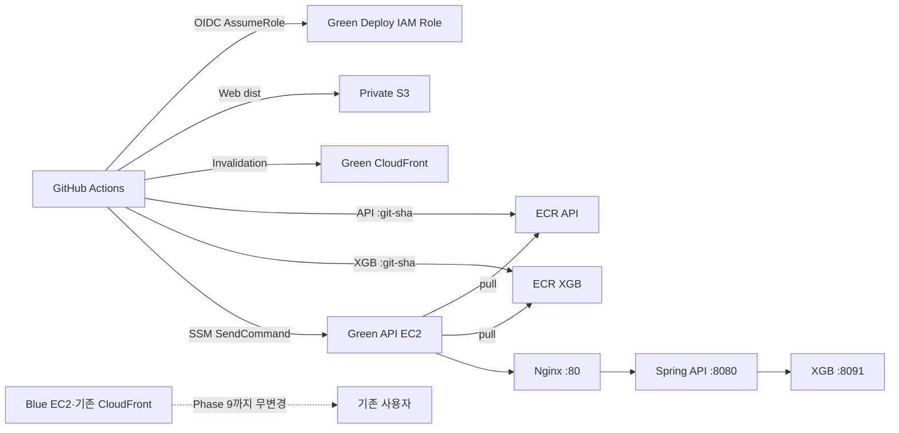

# AWS 인프라 분리 Phase 8 Green CI/CD 분리 따라하기

이 문서는 Phase 7에서 검증한 Green Web·API 환경에 **Web, API, XGB Reranker 독립 배포 파이프라인**을 만드는 절차다. AWS 리소스는 콘솔에서 직접 생성하고, 저장소 변경과 검증은 로컬에서 수행한다.

Phase 8의 핵심은 다음과 같다.

```text
Web 변경
→ GitHub Actions
→ React test/build
→ Private S3
→ Green CloudFront invalidation

API 변경
→ GitHub Actions
→ Gradle test
→ ECR :<40자리-git-sha>
→ SSM Run Command
→ Green EC2 compose pull/up
→ /api/health

XGB 변경
→ GitHub Actions
→ test
→ ECR :<40자리-git-sha>
→ SSM Run Command
→ xgb-reranker만 재배포
```

이번 Phase에서는 **운영 사용자 트래픽을 Green으로 전환하지 않는다.** 기존 Blue EC2, 기존 CloudFront Distribution, 기존 Blue SSH 배포는 Phase 9의 최종 전환과 롤백 대기 완료 전까지 유지한다.

---

## 0. Phase 8 결과 구조



Phase 8 완료 후에도 서비스 URL은 다음처럼 분리되어 있다.

| 용도 | Domain | 상태 |
| --- | --- | --- |
| 기존 운영 Blue | `d1a7gxvxxd385i.cloudfront.net` | 기존 사용자 서비스 유지 |
| 독립 Green 검증 | `d2qhd7deuwmlln.cloudfront.net` | 새 CI/CD 검증 대상 |

AWS가 발급한 기존 CloudFront domain을 신규 Distribution으로 옮길 수는 없다. 운영 URL 전환 방식은 Phase 9에서 처리한다.

---

## 1. 현재 확정값

2026-07-14 Phase 7 완료 상태를 기준으로 한다.

| 항목 | 값 |
| --- | --- |
| AWS Account | `443915990705` |
| Region | `ap-northeast-2` |
| GitHub repository | `jungle-final-project/prototype` |
| 배포 branch | `main` |
| Green EC2 | `i-033105106a7970ac1` |
| Green EIP | `43.203.33.190` |
| Green EC2 IAM Role | `buildgraph-demo-api-green-role` |
| Green S3 bucket | `buildgraph-demo-web-green-443915990705` |
| Green CloudFront ID | `E1MVNMU0O781IM` |
| Green CloudFront domain | `d2qhd7deuwmlln.cloudfront.net` |
| Secret | `buildgraph/demo-green/api-env` |
| 현재 bootstrap SHA | `45a4b1e78cdf44cca1c13cfb55636a15ecdf438b` |
| Blue EC2 | `i-082c21a20e14f3295` |
| Blue Public IP | `15.164.235.183` |
| 기존 Blue CloudFront ID | `EI6MMNZLTTN3H` |

Phase 8에서 새로 사용할 이름을 다음으로 고정한다.

| 리소스 | 이름 |
| --- | --- |
| API ECR repository | `buildgraph-demo-api-green` |
| XGB ECR repository | `buildgraph-demo-xgb-reranker-green` |
| GitHub OIDC IAM Role | `buildgraph-demo-github-actions-green-role` |
| Role inline policy | `BuildGraphGreenDeployPolicy` |
| EC2 image manifest | `/opt/buildgraph/green-images.env` |
| ECR Compose | `compose.api.ecr.prod.yaml` |

---

## 2. 시작 전 하드 게이트

아래 항목 중 하나라도 실패하면 ECR·OIDC 생성이나 Green 자동 배포를 시작하지 않는다.

1. Green CloudFront root가 `200`인지 확인한다.

```bash
curl -fsS https://d2qhd7deuwmlln.cloudfront.net/ >/dev/null &&
echo "PASS: Green Web"
```

2. Green CloudFront API health를 확인한다.

```bash
curl -fsS https://d2qhd7deuwmlln.cloudfront.net/api/health | jq .
```

기대 결과:

```json
{
  "status": "UP",
  "database": "UP"
}
```

3. Green EC2에서 실행 중인 service가 세 개뿐인지 확인한다.

```bash
cd /opt/buildgraph/prototype

docker compose -p buildgraph-green \
  -f compose.api.prod.yaml \
  --env-file .env.prod \
  ps --services --status running |
sort
```

기대 결과:

```text
api
nginx
xgb-reranker
```

4. API와 XGB 포트가 host에 공개되지 않았는지 확인한다.

```bash
docker ps --format 'table {{.Names}}\t{{.Ports}}'
```

- Nginx만 `0.0.0.0:80->80/tcp`를 사용해야 한다.
- API는 `8080/tcp`만 표시되어야 한다.
- XGB는 `8091/tcp`만 표시되어야 한다.

5. Blue 운영 URL과 EC2를 확인한다.

```bash
curl -fsS https://d1a7gxvxxd385i.cloudfront.net/api/health | jq .
```

6. Phase 7 완료 조건 중 Google OAuth를 제외한 필수 Web/API/WebSocket 검증이 PASS인지 확인한다.
7. 기존 `.github/workflows/deploy-compose.yml`을 삭제하거나 Green으로 변경하지 않는다.
8. GitHub의 기존 `EC2_HOST`, `EC2_USER`, `EC2_APP_DIR`, `EC2_SSH_KEY` Secret을 삭제하지 않는다.
9. 기존 CloudFront `EI6MMNZLTTN3H`의 Origin과 behavior를 변경하지 않는다.
10. Green CloudFront `E1MVNMU0O781IM`만 새 Web 파이프라인의 invalidation 대상으로 사용한다.

---

## 3. 현재 저장소가 아직 Phase 8 배포용이 아닌 이유

현재 `compose.api.prod.yaml`의 API와 XGB에는 `build:`가 있다. Green EC2에서 source를 직접 build하는 Phase 6 bootstrap 방식이다.

현재 `.github/workflows/deploy-compose.yml`은 다음 방식이다.

```text
Web/API 동시 build
→ SSH
→ 전체 repository rsync
→ compose.prod.yaml --build
```

따라서 AWS 콘솔에서 ECR만 만든다고 Phase 8이 완료되지 않는다. 다음 저장소 구현이 먼저 필요하다.

| 파일 | 목적 |
| --- | --- |
| `compose.api.ecr.prod.yaml` | API·XGB를 ECR image URI로 실행 |
| `.github/workflows/deploy-web-green.yml` | Web만 S3·CloudFront로 배포 |
| `.github/workflows/deploy-api-green.yml` | API image build·push·SSM 배포 |
| `.github/workflows/deploy-xgb-green.yml` | XGB image build·push·SSM 배포 |
| `tools/deploy_green_ecr.sh` | Green EC2 pull/up·health·rollback |
| `tools/test_validate_green_deployment.py` | ECR/OIDC/SSM 배포 계약 테스트 |

저장소 구현은 반드시 테스트를 먼저 작성한 뒤 진행한다. AWS 콘솔 리소스를 만든 뒤에도 위 파일이 remote `main`에 반영되기 전에는 workflow를 실행하지 않는다.

---

## 4. ECR API repository 생성

1. AWS 콘솔 상단 Region을 `Asia Pacific (Seoul) ap-northeast-2`로 맞춘다.
2. 검색창에서 `Elastic Container Registry` 또는 `ECR`을 검색한다.
3. 왼쪽 메뉴에서 `Private registry` → `Repositories`를 연다.
4. `Create repository`를 누른다.
5. Visibility settings는 `Private`를 선택한다.
6. Repository name에 다음을 입력한다.

```text
buildgraph-demo-api-green
```

7. Tag immutability는 `Enabled`를 선택한다.
8. Mutable tag exclusion을 추가하지 않는다.
9. Scan on push 또는 Basic scanning의 scan on push를 활성화한다.
10. Encryption은 `AES-256`을 선택한다.
11. KMS customer managed key를 새로 만들지 않는다.
12. `Create repository`를 누른다.
13. 생성 후 URI가 다음 형태인지 확인한다.

```text
443915990705.dkr.ecr.ap-northeast-2.amazonaws.com/buildgraph-demo-api-green
```

14. URI를 29번 기록표에 적는다.

`latest` tag를 사용하지 않는다. 모든 image는 검증된 40자리 Git SHA를 tag로 사용한다.

---

## 5. ECR XGB repository 생성

4번과 같은 방식으로 두 번째 private repository를 만든다.

| 항목 | 값 |
| --- | --- |
| Repository name | `buildgraph-demo-xgb-reranker-green` |
| Tag immutability | Enabled |
| Scan on push | Enabled |
| Encryption | AES-256 |

예상 URI:

```text
443915990705.dkr.ecr.ap-northeast-2.amazonaws.com/buildgraph-demo-xgb-reranker-green
```

API와 XGB image를 같은 repository의 다른 tag로 섞지 않는다.

---

## 6. ECR lifecycle policy 설정

롤백용 이전 SHA image를 보존하되 무제한 쌓이지 않게 각 repository에 최근 30개를 유지한다.

1. API repository를 연다.
2. `Lifecycle policy`를 연다.
3. `Create rule`을 누른다.
4. Rule priority는 `1`로 설정한다.
5. Description에 다음을 입력한다.

```text
Keep latest 30 immutable Git SHA images
```

6. Image status는 `Any`를 선택한다.
7. Match criteria는 `Image count more than`을 선택한다.
8. Count는 `30`으로 입력한다.
9. Action은 `Expire`를 선택한다.
10. Preview에서 최근 30개보다 오래된 image만 대상인지 확인한다.
11. 저장한다.
12. XGB repository에도 같은 정책을 설정한다.

최초 배포 직후 image가 30개 미만이면 삭제 대상이 없는 것이 정상이다.

---

## 7. GitHub OIDC provider 확인·생성

GitHub Actions가 장기 AWS Access Key 없이 AWS Role을 임시로 사용하도록 연결한다.

### 7.1 기존 provider 확인

1. IAM 콘솔을 연다.
2. 왼쪽 메뉴에서 `Identity providers`를 연다.
3. 다음 provider가 있는지 찾는다.

```text
token.actions.githubusercontent.com
```

4. 이미 있으면 새로 만들지 않고 8번으로 이동한다.
5. 기존 provider의 Audience에 `sts.amazonaws.com`이 있는지 확인한다.

### 7.2 provider 생성

기존 provider가 없을 때만 수행한다.

1. `Add provider`를 누른다.
2. Provider type은 `OpenID Connect`를 선택한다.
3. Provider URL에 다음을 입력한다.

```text
https://token.actions.githubusercontent.com
```

4. `Get thumbprint` 또는 확인 버튼이 있으면 누른다.
5. Audience에 다음을 입력한다.

```text
sts.amazonaws.com
```

6. `Add provider`를 누른다.
7. 생성된 provider ARN이 다음인지 확인한다.

```text
arn:aws:iam::443915990705:oidc-provider/token.actions.githubusercontent.com
```

---

## 8. GitHub Actions Green 배포 Role 생성

### 8.1 Role 기본 생성

1. IAM 콘솔에서 `Roles`를 연다.
2. `Create role`을 누른다.
3. Trusted entity type은 `Web identity`를 선택한다.
4. Identity provider는 `token.actions.githubusercontent.com`을 선택한다.
5. Audience는 `sts.amazonaws.com`을 선택한다.
6. GitHub organization에 다음을 입력한다.

```text
jungle-final-project
```

7. GitHub repository에 다음을 입력한다.

```text
prototype
```

8. GitHub branch가 표시되면 `main`으로 제한한다.
9. Permissions policy 단계에서는 임시로 policy 없이 다음으로 이동한다.
10. Role name에 다음을 입력한다.

```text
buildgraph-demo-github-actions-green-role
```

11. Description에 다음을 입력한다.

```text
GitHub OIDC role for BuildGraph Green ECR, S3, CloudFront invalidation, and SSM deploy
```

12. Role을 생성한다.

### 8.2 Trust policy 확인

생성한 Role의 `Trust relationships` → `Edit trust policy`를 연다. 다음과 같아야 한다.

```json
{
  "Version": "2012-10-17",
  "Statement": [
    {
      "Effect": "Allow",
      "Principal": {
        "Federated": "arn:aws:iam::443915990705:oidc-provider/token.actions.githubusercontent.com"
      },
      "Action": "sts:AssumeRoleWithWebIdentity",
      "Condition": {
        "StringEquals": {
          "token.actions.githubusercontent.com:aud": "sts.amazonaws.com",
          "token.actions.githubusercontent.com:sub": "repo:jungle-final-project/prototype:ref:refs/heads/main"
        }
      }
    }
  ]
}
```

반드시 확인할 내용:

- 다른 repository는 Role을 사용할 수 없다.
- `pull_request` ref는 배포 Role을 사용할 수 없다.
- `dev` branch는 배포 Role을 사용할 수 없다.
- GitHub Actions job에 별도 `environment:`를 지정하면 OIDC `sub` 형식이 바뀌므로 이번 설정에서는 지정하지 않는다.

### 8.3 배포 inline policy 연결

1. Role의 `Permissions` 탭을 연다.
2. `Add permissions` → `Create inline policy`를 누른다.
3. `JSON`을 선택한다.
4. 다음 정책을 입력한다.

```json
{
  "Version": "2012-10-17",
  "Statement": [
    {
      "Sid": "EcrLogin",
      "Effect": "Allow",
      "Action": "ecr:GetAuthorizationToken",
      "Resource": "*"
    },
    {
      "Sid": "PushGreenImages",
      "Effect": "Allow",
      "Action": [
        "ecr:BatchCheckLayerAvailability",
        "ecr:BatchGetImage",
        "ecr:CompleteLayerUpload",
        "ecr:DescribeImages",
        "ecr:GetDownloadUrlForLayer",
        "ecr:InitiateLayerUpload",
        "ecr:PutImage",
        "ecr:UploadLayerPart"
      ],
      "Resource": [
        "arn:aws:ecr:ap-northeast-2:443915990705:repository/buildgraph-demo-api-green",
        "arn:aws:ecr:ap-northeast-2:443915990705:repository/buildgraph-demo-xgb-reranker-green"
      ]
    },
    {
      "Sid": "ListGreenWebBucket",
      "Effect": "Allow",
      "Action": [
        "s3:GetBucketLocation",
        "s3:ListBucket"
      ],
      "Resource": "arn:aws:s3:::buildgraph-demo-web-green-443915990705"
    },
    {
      "Sid": "DeployGreenWebObjects",
      "Effect": "Allow",
      "Action": [
        "s3:DeleteObject",
        "s3:GetObject",
        "s3:PutObject"
      ],
      "Resource": "arn:aws:s3:::buildgraph-demo-web-green-443915990705/*"
    },
    {
      "Sid": "InvalidateGreenCloudFront",
      "Effect": "Allow",
      "Action": "cloudfront:CreateInvalidation",
      "Resource": "arn:aws:cloudfront::443915990705:distribution/E1MVNMU0O781IM"
    },
    {
      "Sid": "RunGreenDeployment",
      "Effect": "Allow",
      "Action": "ssm:SendCommand",
      "Resource": [
        "arn:aws:ssm:ap-northeast-2::document/AWS-RunShellScript",
        "arn:aws:ec2:ap-northeast-2:443915990705:instance/i-033105106a7970ac1"
      ]
    },
    {
      "Sid": "ReadGreenDeploymentResult",
      "Effect": "Allow",
      "Action": [
        "ssm:GetCommandInvocation",
        "ssm:ListCommandInvocations"
      ],
      "Resource": "*"
    }
  ]
}
```

5. Policy name에 다음을 입력한다.

```text
BuildGraphGreenDeployPolicy
```

6. 저장한다.
7. Role ARN을 복사해 29번 기록표에 적는다.

예상 ARN:

```text
arn:aws:iam::443915990705:role/buildgraph-demo-github-actions-green-role
```

이 Role에는 다음 권한을 추가하지 않는다.

- `AdministratorAccess`
- `AmazonS3FullAccess`
- `AmazonEC2FullAccess`
- `SecretsManagerReadWrite`
- `iam:PassRole`
- Blue EC2 대상 `ssm:SendCommand`
- 기존 Blue CloudFront invalidation 권한

GitHub Role은 Secret value를 읽지 않는다. Green EC2 Role이 기존처럼 지정 Secret 한 개만 읽는다.

---

## 9. GitHub Actions repository variables 등록

1. GitHub에서 `jungle-final-project/prototype` repository를 연다.
2. `Settings`를 누른다.
3. `Secrets and variables` → `Actions`를 연다.
4. `Variables` 탭을 선택한다.
5. 다음 repository variable을 만든다.

| Name | Value |
| --- | --- |
| `AWS_REGION` | `ap-northeast-2` |
| `AWS_DEPLOY_ROLE_ARN` | `arn:aws:iam::443915990705:role/buildgraph-demo-github-actions-green-role` |
| `AWS_ACCOUNT_ID` | `443915990705` |
| `GREEN_EC2_INSTANCE_ID` | `i-033105106a7970ac1` |
| `GREEN_S3_BUCKET` | `buildgraph-demo-web-green-443915990705` |
| `GREEN_CF_DISTRIBUTION_ID` | `E1MVNMU0O781IM` |
| `GREEN_CF_DOMAIN` | `d2qhd7deuwmlln.cloudfront.net` |
| `GREEN_API_ECR_REPOSITORY` | `buildgraph-demo-api-green` |
| `GREEN_XGB_ECR_REPOSITORY` | `buildgraph-demo-xgb-reranker-green` |
| `GREEN_CD_ENABLED` | `false` |

`GREEN_CD_ENABLED=false`는 최초 ECR bootstrap 전에 자동 배포되는 것을 막는 안전장치다.

다음 값은 GitHub Secret으로 만들지 않는다.

- AWS Access Key ID
- AWS Secret Access Key
- EC2 SSH private key for Green
- RDS password
- Redis AUTH token
- RabbitMQ password
- OpenAI API key
- `.env.prod` 원문

기존 Blue 배포용 GitHub Secret은 Phase 9까지 삭제하지 않는다.

---

## 10. Phase 8 저장소 구현

이 단계는 로컬 repository에서 수행한다. 기능 코드는 테스트를 먼저 작성한다.

### 10.1 테스트를 먼저 작성

`tools/test_validate_green_deployment.py`를 먼저 추가해 최소한 다음 실패 조건을 검증한다.

1. ECR Compose에 `nginx`, `api`, `xgb-reranker` 외 service가 있으면 실패한다.
2. ECR Compose의 API에 `build:`가 남아 있으면 실패한다.
3. ECR Compose의 XGB에 `build:`가 남아 있으면 실패한다.
4. API image가 `API_IMAGE_URI` 환경변수를 사용하지 않으면 실패한다.
5. XGB image가 `XGB_IMAGE_URI` 환경변수를 사용하지 않으면 실패한다.
6. API `8080`이 host에 publish되면 실패한다.
7. XGB `8091`이 host에 publish되면 실패한다.
8. Nginx 외 service가 host port `80`을 사용하면 실패한다.
9. workflow가 `latest` tag를 사용하면 실패한다.
10. workflow가 AWS access key Secret을 사용하면 실패한다.
11. Green API workflow가 SSH·rsync를 사용하면 실패한다.
12. Green API workflow가 SSM을 사용하지 않으면 실패한다.
13. Web workflow가 Blue CloudFront ID를 사용하면 실패한다.
14. Web workflow가 `index.html`과 hash asset에 같은 Cache-Control을 사용하면 실패한다.

### 10.2 ECR Compose 구현 계약

`compose.api.ecr.prod.yaml`은 다음 조건을 만족해야 한다.

| Service | Image |
| --- | --- |
| `nginx` | `nginx:1.27-alpine` |
| `api` | `${API_IMAGE_URI:?API_IMAGE_URI is required}` |
| `xgb-reranker` | `${XGB_IMAGE_URI:?XGB_IMAGE_URI is required}` |

- `api`와 `xgb-reranker`에 `build:`를 두지 않는다.
- Nginx는 `infra/nginx/api.conf`를 read-only mount한다.
- Nginx만 `80:80`을 publish한다.
- API와 XGB는 각각 `expose: 8080`, `expose: 8091`만 사용한다.
- Phase 6의 `compose.api.prod.yaml`은 bootstrap rollback을 위해 당장 삭제하지 않는다.
- `web`, `postgres`, `redis`, `rabbitmq`, `mailpit`을 추가하지 않는다.

### 10.3 image manifest 계약

Green EC2의 `/opt/buildgraph/green-images.env`에는 비밀번호가 아니라 현재 실행 image URI만 저장한다.

```dotenv
API_IMAGE_URI=443915990705.dkr.ecr.ap-northeast-2.amazonaws.com/buildgraph-demo-api-green:<API_GIT_SHA>
XGB_IMAGE_URI=443915990705.dkr.ecr.ap-northeast-2.amazonaws.com/buildgraph-demo-xgb-reranker-green:<XGB_GIT_SHA>
```

- API와 XGB SHA는 독립적으로 바뀔 수 있다.
- tag는 각각 정확한 40자리 Git SHA다.
- `latest`, `main`, 날짜 tag를 현재 실행 기준으로 사용하지 않는다.
- 파일 권한은 `600 ubuntu:ubuntu`으로 둔다.
- Secret value는 이 파일에 넣지 않는다.

### 10.4 배포 script 계약

`tools/deploy_green_ecr.sh`는 다음 동작을 가져야 한다.

1. 인자로 `api` 또는 `xgb-reranker`, Git SHA, ECR image URI를 받는다.
2. 40자리 SHA 형식을 검사한다.
3. 대상 ECR repository가 허용된 두 repository 중 하나인지 검사한다.
4. `flock`으로 API와 XGB 동시 배포를 직렬화한다.
5. 현재 Git SHA와 `/opt/buildgraph/green-images.env`를 rollback 값으로 백업한다.
6. remote `origin`에서 target SHA를 fetch한다.
7. `git checkout --detach <SHA>`로 Nginx·Compose·script도 같은 commit에 고정한다.
8. Secret을 임시 파일로 내려받은 뒤 성공했을 때만 `.env.prod`로 교체한다.
9. ECR login 후 대상 image만 pull한다.
10. candidate image manifest로 `docker compose config --quiet`를 실행한다.
11. 대상 service만 `up -d --no-deps --force-recreate --no-build`한다.
12. API 배포는 `/api/health`가 돌아올 때까지 기다린다.
13. XGB 배포는 container health가 `healthy`인지 확인한다.
14. 성공하면 candidate manifest를 active manifest로 교체한다.
15. 실패하면 이전 Git SHA와 이전 image manifest로 자동 rollback한다.
16. command output에 Secret 원문이나 `.env.prod` 내용을 출력하지 않는다.

### 10.5 세 workflow의 분리 기준

| Workflow | 자동 trigger path | 수행 작업 |
| --- | --- | --- |
| Web | `apps/web/**` | test/build, S3, Green invalidation |
| API | `apps/api/**`, `infra/nginx/api.conf`, ECR Compose·deploy script | test, API image, SSM |
| XGB | `tools/reranker_service.py`, `tools/recommendation_reranker_requirements.txt`, XGB Dockerfile | test, XGB image, SSM |

각 workflow의 top-level 권한은 다음을 포함한다.

```yaml
permissions:
  contents: read
  id-token: write
```

OIDC 로그인은 공식 action을 사용한다.

```yaml
- uses: aws-actions/configure-aws-credentials@v4
  with:
    role-to-assume: ${{ vars.AWS_DEPLOY_ROLE_ARN }}
    aws-region: ${{ vars.AWS_REGION }}
```

API·XGB image tag는 다음 값만 사용한다.

```text
${{ github.sha }}
```

ECR tag immutability 때문에 같은 SHA workflow를 재실행할 때는 먼저 `describe-images`로 tag 존재 여부를 확인한다. 이미 존재하면 동일 SHA image를 재사용하고 `PutImage`를 다시 시도하지 않는다.

### 10.6 Web Cache-Control 계약

Web workflow는 한 번의 동일한 `aws s3 sync`로 전체 dist를 올리지 않는다.

| 대상 | Cache-Control |
| --- | --- |
| `dist/assets/**` | `public,max-age=31536000,immutable` |
| `dist/index.html` | `no-cache,max-age=0,must-revalidate` |
| `dist/downloads/pc-agent/latest.json` | `no-cache,max-age=0,must-revalidate` |
| 나머지 root/public asset | `public,max-age=3600` |

S3 업로드 후 Green Distribution에서 다음 path를 invalidation한다.

```text
/
/index.html
/downloads/pc-agent/latest.json
```

### 10.7 로컬 검증

저장소 구현 후 다음을 실행한다.

```bash
cd /Users/juhoseok/Desktop/prototype

python3 -m pip install -r tools/requirements.txt
python3 -m unittest \
  tools.test_validate_infrastructure_separation \
  tools.test_validate_green_deployment

python3 tools/validate_infrastructure_separation.py
```

ECR Compose용 example env를 사용해 config를 렌더링한다.

```bash
docker compose \
  -p buildgraph-green \
  -f compose.api.ecr.prod.yaml \
  --env-file .env.prod.example \
  --env-file .env.images.example \
  config --quiet
```

service 목록은 다음 세 개뿐이어야 한다.

```bash
docker compose \
  -p buildgraph-green \
  -f compose.api.ecr.prod.yaml \
  --env-file .env.prod.example \
  --env-file .env.images.example \
  config --services |
sort
```

```text
api
nginx
xgb-reranker
```

Workflow YAML은 가능한 경우 `actionlint`로 검증한다.

```bash
actionlint \
  .github/workflows/deploy-web-green.yml \
  .github/workflows/deploy-api-green.yml \
  .github/workflows/deploy-xgb-green.yml
```

모든 테스트가 PASS한 commit만 `main`에 반영한다.

---

## 11. 첫 workflow 반영 전 안전장치

1. 세 Green workflow가 `GREEN_CD_ENABLED`를 확인하도록 구현했는지 확인한다.
2. `GREEN_CD_ENABLED=false`이면 `push` event의 배포 job이 skip되어야 한다.
3. `workflow_dispatch`에는 다음 입력을 둔다.

| Input | 용도 |
| --- | --- |
| `git_sha` | 배포할 40자리 SHA |
| `publish_only` | ECR/S3 publish만 하고 EC2 재배포는 생략 |

4. Web workflow는 `publish_only`가 필요 없으며 Green S3·CloudFront만 대상으로 한다.
5. API·XGB 최초 실행은 `publish_only=true`로 한다.
6. 자동 배포 활성화는 20번의 독립 배포와 rollback 검증 후 수행한다.

---

## 12. ECR image 최초 publish

저장소 변경이 `main`에 반영되고 CI가 PASS한 뒤 수행한다.

### 12.1 배포 SHA 확정

로컬에서 다음을 실행한다.

```bash
cd /Users/juhoseok/Desktop/prototype
git fetch origin
git rev-parse origin/main
```

출력된 40자리 SHA를 29번 기록표에 적는다.

### 12.2 API image publish-only

1. GitHub repository의 `Actions`를 연다.
2. `Deploy Green API` workflow를 연다.
3. `Run workflow`를 누른다.
4. Branch는 `main`을 선택한다.
5. `git_sha`에 40자리 SHA를 입력한다.
6. `publish_only`는 `true`를 선택한다.
7. 실행한다.
8. test, image build, OIDC, ECR push가 PASS인지 확인한다.
9. SSM deploy 단계가 실행되지 않았는지 확인한다.

### 12.3 XGB image publish-only

같은 SHA로 `Deploy Green XGB` workflow를 실행한다.

- Branch: `main`
- `git_sha`: 같은 40자리 SHA
- `publish_only`: `true`

### 12.4 ECR console 확인

각 repository의 `Images` 탭에서 다음을 확인한다.

- Image tag가 40자리 Git SHA다.
- 두 repository 모두 같은 최초 SHA image가 있다.
- `latest` tag가 없다.
- Image digest가 비어 있지 않다.
- Scan status가 완료되거나 진행 중이다.
- Critical vulnerability가 있으면 자동 배포 전에 내용을 확인한다.

---

## 13. Green EC2의 ECR pull 권한 확인

Green EC2 Role에는 이미 `AmazonEC2ContainerRegistryReadOnly`가 연결되어 있어야 한다.

1. EC2 콘솔에서 `buildgraph-demo-api-green-ec2`를 연다.
2. Security details의 IAM Role이 `buildgraph-demo-api-green-role`인지 확인한다.
3. IAM Role을 눌러 Permissions를 연다.
4. 다음 policy가 있는지 확인한다.

```text
AmazonEC2ContainerRegistryReadOnly
```

5. Session Manager로 Green EC2에 접속한다.
6. Ubuntu shell로 전환한다.

```bash
sudo -iu ubuntu
```

7. ECR login과 image 조회를 확인한다. `<SHA>`를 실제 값으로 바꾼다.

```bash
aws ecr get-login-password --region ap-northeast-2 |
docker login \
  --username AWS \
  --password-stdin \
  443915990705.dkr.ecr.ap-northeast-2.amazonaws.com

docker manifest inspect \
  443915990705.dkr.ecr.ap-northeast-2.amazonaws.com/buildgraph-demo-api-green:<SHA> \
  >/dev/null &&
echo "PASS: API image readable"
```

비밀번호나 ECR login token을 화면에 직접 출력하지 않는다.

---

## 14. ECR Compose 최초 bootstrap

이 단계에서 Phase 6 source-built API·XGB container를 ECR image container로 처음 교체한다. Nginx와 host port 구성은 그대로 유지한다.

### 14.1 현재 상태 백업

Green EC2의 Ubuntu shell에서 실행한다.

```bash
cd /opt/buildgraph/prototype

git rev-parse HEAD | tee /opt/buildgraph/pre-phase8-git-sha.txt

docker inspect buildgraph-green-api-1 \
  --format '{{.Config.Image}}' |
tee /opt/buildgraph/pre-phase8-api-image.txt

docker inspect buildgraph-green-xgb-reranker-1 \
  --format '{{.Config.Image}}' |
tee /opt/buildgraph/pre-phase8-xgb-image.txt
```

출력에 Secret은 포함되지 않는다.

### 14.2 target Git SHA checkout

`<SHA>`를 12번의 실제 40자리 SHA로 바꾼다.

```bash
cd /opt/buildgraph/prototype

export GREEN_DEPLOY_GIT_SHA="<SHA>"

git fetch origin
git cat-file -e "$GREEN_DEPLOY_GIT_SHA^{commit}"
git checkout --detach "$GREEN_DEPLOY_GIT_SHA"
git rev-parse HEAD
```

출력 SHA가 입력한 SHA와 같아야 한다.

### 14.3 Secret 안전 재적용

```bash
cd /opt/buildgraph/prototype
umask 077

aws secretsmanager get-secret-value \
  --secret-id buildgraph/demo-green/api-env \
  --region ap-northeast-2 \
  --query SecretString \
  --output text \
  --no-cli-pager > .env.prod.new

test -s .env.prod.new
chmod 600 .env.prod.new
mv .env.prod.new .env.prod

stat -c '%a %U:%G %n' .env.prod
```

기대 결과:

```text
600 ubuntu:ubuntu .env.prod
```

### 14.4 최초 image manifest 생성

`<SHA>` 두 곳을 실제 SHA로 바꾼다.

```bash
umask 077

printf '%s\n' \
  'API_IMAGE_URI=443915990705.dkr.ecr.ap-northeast-2.amazonaws.com/buildgraph-demo-api-green:<SHA>' \
  'XGB_IMAGE_URI=443915990705.dkr.ecr.ap-northeast-2.amazonaws.com/buildgraph-demo-xgb-reranker-green:<SHA>' \
  > /opt/buildgraph/green-images.env

chmod 600 /opt/buildgraph/green-images.env
chown ubuntu:ubuntu /opt/buildgraph/green-images.env

stat -c '%a %U:%G %n' /opt/buildgraph/green-images.env
```

기대 결과:

```text
600 ubuntu:ubuntu /opt/buildgraph/green-images.env
```

`<SHA>` 문자열을 그대로 남겨 두면 안 된다.

```bash
if grep -q '<SHA>' /opt/buildgraph/green-images.env; then
  echo 'FAIL: SHA placeholder remains'
else
  echo 'PASS: image manifest has real SHA'
fi
```

### 14.5 Compose config 검증

```bash
cd /opt/buildgraph/prototype
set -o pipefail

docker compose -p buildgraph-green \
  -f compose.api.ecr.prod.yaml \
  --env-file .env.prod \
  --env-file /opt/buildgraph/green-images.env \
  config --quiet

docker compose -p buildgraph-green \
  -f compose.api.ecr.prod.yaml \
  --env-file .env.prod \
  --env-file /opt/buildgraph/green-images.env \
  config --services |
sort
```

service가 `api`, `nginx`, `xgb-reranker` 세 개뿐인지 확인한다.

### 14.6 ECR image pull과 교체

```bash
cd /opt/buildgraph/prototype

aws ecr get-login-password --region ap-northeast-2 |
docker login \
  --username AWS \
  --password-stdin \
  443915990705.dkr.ecr.ap-northeast-2.amazonaws.com

docker compose -p buildgraph-green \
  -f compose.api.ecr.prod.yaml \
  --env-file .env.prod \
  --env-file /opt/buildgraph/green-images.env \
  pull api xgb-reranker

docker compose -p buildgraph-green \
  -f compose.api.ecr.prod.yaml \
  --env-file .env.prod \
  --env-file /opt/buildgraph/green-images.env \
  up -d --no-build --remove-orphans
```

이 명령은 RDS, Redis, RabbitMQ를 재시작하지 않는다. 관리형 서비스이므로 Compose 대상이 아니다.

### 14.7 health 확인

```bash
for attempt in $(seq 1 60); do
  if curl -fsS http://127.0.0.1/api/health; then
    echo
    break
  fi

  if [ "$attempt" -eq 60 ]; then
    docker compose -p buildgraph-green \
      -f compose.api.ecr.prod.yaml \
      --env-file .env.prod \
      --env-file /opt/buildgraph/green-images.env \
      ps
    exit 1
  fi

  sleep 2
done
```

```bash
docker compose -p buildgraph-green \
  -f compose.api.ecr.prod.yaml \
  --env-file .env.prod \
  --env-file /opt/buildgraph/green-images.env \
  ps

docker ps --format 'table {{.Names}}\t{{.Image}}\t{{.Ports}}'
```

다음을 확인한다.

- API image가 ECR URI와 Git SHA tag를 사용한다.
- XGB image가 ECR URI와 Git SHA tag를 사용한다.
- Nginx만 host port `80`을 사용한다.
- `/healthz`와 `/api/health`가 성공한다.
- Green CloudFront의 `/api/health`도 성공한다.

---

## 15. Web workflow 수동 검증

1. GitHub Actions에서 `Deploy Green Web`을 연다.
2. `Run workflow`를 누른다.
3. Branch는 `main`을 선택한다.
4. 배포 SHA가 current `origin/main`인지 확인한다.
5. 실행한다.
6. 다음 단계가 모두 PASS인지 확인한다.

- `npm ci`
- `npm run test -- --workers=1`
- `VITE_API_BASE_URL=` 상태의 `npm run build`
- hash asset S3 sync
- root/public asset S3 sync
- `index.html` no-cache upload
- `latest.json` no-cache upload
- Green CloudFront invalidation

7. S3에서 다음 metadata를 확인한다.

| Object | 기대 Cache-Control |
| --- | --- |
| `index.html` | `no-cache,max-age=0,must-revalidate` |
| `assets/<hash>.js` | `public,max-age=31536000,immutable` |
| `favicon.svg` | `public,max-age=3600` |
| `downloads/pc-agent/latest.json` | `no-cache,max-age=0,must-revalidate` |

8. Green domain을 확인한다.

```bash
curl -fsS https://d2qhd7deuwmlln.cloudfront.net/ >/dev/null &&
echo 'PASS: Green Web deployment'

curl -fsS https://d2qhd7deuwmlln.cloudfront.net/parts >/dev/null &&
echo 'PASS: Green SPA route'
```

9. Blue domain도 계속 성공하는지 확인한다.

```bash
curl -fsS https://d1a7gxvxxd385i.cloudfront.net/ >/dev/null &&
echo 'PASS: Blue unchanged'
```

---

## 16. API workflow 수동 배포 검증

1. GitHub Actions에서 `Deploy Green API`를 연다.
2. `Run workflow`를 누른다.
3. Branch는 `main`을 선택한다.
4. `git_sha`에 검증할 40자리 `origin/main` SHA를 입력한다.
5. `publish_only`는 `false`를 선택한다.
6. 실행한다.
7. 다음 단계가 PASS인지 확인한다.

- API test
- Infrastructure validator
- Docker image build
- OIDC Role assume
- ECR image 존재 확인 또는 push
- SSM SendCommand
- Green EC2 ECR pull
- API container만 recreate
- `/api/health` 확인

8. workflow log에 SSH private key, `ssh`, `rsync`가 사용되지 않았는지 확인한다.
9. workflow log에 `.env.prod` 원문이 출력되지 않았는지 확인한다.
10. Green EC2에서 실행 image와 health를 확인한다.

```bash
docker inspect buildgraph-green-api-1 \
  --format '{{.Config.Image}}'

curl -fsS http://127.0.0.1/api/health | jq .
curl -fsS https://d2qhd7deuwmlln.cloudfront.net/api/health | jq .
```

11. XGB container의 Created 시간이 API 배포 전과 같거나 재생성되지 않았는지 확인한다.
12. Blue health도 확인한다.

```bash
curl -fsS https://d1a7gxvxxd385i.cloudfront.net/api/health | jq .
```

---

## 17. XGB workflow 수동 배포 검증

1. GitHub Actions에서 `Deploy Green XGB`를 연다.
2. `Run workflow`를 누른다.
3. Branch는 `main`을 선택한다.
4. `git_sha`에 검증할 40자리 SHA를 입력한다.
5. `publish_only`는 `false`를 선택한다.
6. 실행한다.
7. 다음 단계가 PASS인지 확인한다.

- Reranker test
- Docker image build
- OIDC Role assume
- XGB ECR push 또는 기존 SHA 재사용
- SSM SendCommand
- `xgb-reranker`만 pull/recreate
- XGB container health `healthy`

8. Green EC2에서 확인한다.

```bash
docker inspect buildgraph-green-xgb-reranker-1 \
  --format '{{.Config.Image}} {{.State.Health.Status}}'

curl -fsS http://127.0.0.1/api/health | jq .
```

9. API container가 XGB 배포 때문에 재생성되지 않았는지 확인한다.
10. XGB는 host port `8091`을 publish하지 않아야 한다.

---

## 18. API 이전 SHA rollback drill

Phase 8 완료 전에 API rollback을 실제로 한 번 검증한다. 사용자 트래픽은 아직 Blue에 있으므로 Green에서 안전하게 수행할 수 있다.

1. ECR API repository에서 현재 SHA와 직전 정상 SHA를 확인한다.
2. `/opt/buildgraph/green-images.env`의 현재 API URI를 별도 기록한다.
3. API workflow의 manual input에 직전 정상 SHA를 넣어 배포한다.
4. Green `/api/health`가 성공하는지 확인한다.
5. API image URI가 직전 SHA로 바뀌었는지 확인한다.
6. 다시 최신 정상 SHA를 입력해 API를 배포한다.
7. Green `/api/health`와 주요 smoke test를 다시 확인한다.

Rollback은 DB·Redis·RabbitMQ data를 되돌리는 작업이 아니다. 실행 image와 같은 commit의 Nginx·Compose·deploy script만 이전 SHA로 되돌린다.

---

## 19. Web/API/XGB 독립 배포 증명

세 pipeline이 실제로 분리되었는지 다음 표로 확인한다.

| 실행한 workflow | 바뀌어야 하는 대상 | 바뀌면 안 되는 대상 |
| --- | --- | --- |
| Web | S3 object, Green CF invalidation | API/XGB container, Blue CF |
| API | API image/container | S3 Web, XGB container, Blue EC2 |
| XGB | XGB image/container | S3 Web, API container, Blue EC2 |

검증 전 각 container ID를 기록한다.

```bash
docker inspect buildgraph-green-api-1 \
  --format 'api={{.Id}} created={{.Created}} image={{.Config.Image}}'

docker inspect buildgraph-green-xgb-reranker-1 \
  --format 'xgb={{.Id}} created={{.Created}} image={{.Config.Image}}'
```

각 workflow 실행 후 의도한 대상만 바뀌었는지 다시 비교한다.

---

## 20. 자동 배포 활성화

14~19번이 모두 PASS한 뒤에만 수행한다.

1. GitHub repository의 `Settings`를 연다.
2. `Secrets and variables` → `Actions` → `Variables`를 연다.
3. `GREEN_CD_ENABLED`를 찾는다.
4. 값을 다음으로 변경한다.

```text
true
```

5. 저장한다.
6. 세 workflow의 `push` trigger가 `main`과 담당 path로 제한되어 있는지 다시 확인한다.
7. Pull Request에서는 test만 수행되고 배포가 실행되지 않는지 확인한다.
8. `main` push에서 바뀐 영역의 Green workflow만 실행되는지 확인한다.

`GREEN_CD_ENABLED=true`는 Green 자동 배포만 활성화한다. Phase 9 전까지 기존 Blue `deploy-compose.yml`도 별도로 동작할 수 있으므로, 같은 `main` push가 Blue에도 배포될 수 있다는 점을 알고 있어야 한다. Phase 9에서 운영 전환과 롤백 대기가 끝나면 Blue workflow를 비활성화한다.

---

## 21. GitHub Actions와 SSM 실행 기록 확인

### 21.1 GitHub Actions

각 workflow run에서 다음을 기록한다.

- Workflow name
- Git SHA
- Run ID 또는 URL
- ECR image URI
- SSM Command ID
- Health 결과
- Rollback 여부

### 21.2 Systems Manager

1. AWS Systems Manager 콘솔을 연다.
2. `Run Command`를 연다.
3. `Command history`를 연다.
4. Green workflow가 보낸 `AWS-RunShellScript`를 선택한다.
5. Target이 `i-033105106a7970ac1` 하나뿐인지 확인한다.
6. Status가 `Success`인지 확인한다.
7. Output에 Secret value가 없는지 확인한다.
8. Blue `i-082c21a20e14f3295`가 target에 포함되지 않았는지 확인한다.

---

## 22. Blue 무변경 확인

Phase 8 완료 직전에 확인한다.

1. Blue EC2 `i-082c21a20e14f3295`가 Running인지 확인한다.
2. Blue Public IP가 `15.164.235.183`인지 확인한다.
3. 기존 CloudFront `EI6MMNZLTTN3H`가 Enabled·Deployed인지 확인한다.
4. 기존 Blue CloudFront Origin과 behavior가 Phase 7 이전 값 그대로인지 확인한다.
5. Blue Compose가 기존 service를 계속 실행하는지 확인한다.
6. 기존 `.github/workflows/deploy-compose.yml`이 삭제되지 않았는지 확인한다.
7. Green GitHub Role의 SSM 대상이 Green instance 하나뿐인지 확인한다.

Phase 8에서는 다음을 하지 않는다.

- Blue EC2 Stop·Terminate
- Blue EBS·Volume 삭제
- Blue SSH GitHub Secret 삭제
- Blue CloudFront Origin 변경
- Green domain을 기존 AWS 발급 domain으로 교체
- RDS·Redis·RabbitMQ 재생성
- 공유 SG의 SSH 22 제거

SSH 22 제거는 배포 파이프라인 검증과 Phase 9 롤백 대기 완료 후 별도 보안 작업으로 결정한다. 현재 사용자가 SSH 접속도 유지하기로 했으므로 Phase 8 필수 완료 조건으로 닫지 않는다.

---

## 23. Phase 8 완료 조건

- [ ] Phase 7 Green Web·API·WebSocket 검증이 유지됨
- [ ] Blue EC2·Public IP·Compose 무변경
- [ ] 기존 Blue CloudFront Origin·behavior 무변경
- [ ] API ECR repository 생성
- [ ] XGB ECR repository 생성
- [ ] 두 ECR repository tag immutability 활성
- [ ] 두 ECR repository scan on push 활성
- [ ] ECR lifecycle에서 최근 30개 image 보존
- [ ] GitHub OIDC provider 생성 또는 기존 provider 확인
- [ ] OIDC audience가 `sts.amazonaws.com`
- [ ] OIDC Role trust가 `jungle-final-project/prototype`의 `main`만 허용
- [ ] GitHub Role이 두 ECR repository에만 push 가능
- [ ] GitHub Role이 Green S3 bucket에만 배포 가능
- [ ] GitHub Role이 Green CloudFront만 invalidation 가능
- [ ] GitHub Role이 Green EC2에만 SSM SendCommand 가능
- [ ] GitHub Role에 Secret 읽기·SSH·관리자 권한 없음
- [ ] GitHub repository variable 등록
- [ ] AWS 장기 Access Key를 GitHub Secret에 추가하지 않음
- [ ] `compose.api.ecr.prod.yaml` 추가
- [ ] ECR Compose service가 `nginx`, `api`, `xgb-reranker`만 존재
- [ ] ECR Compose의 API·XGB에 `build:` 없음
- [ ] API·XGB image가 40자리 Git SHA tag 사용
- [ ] `latest` tag 없음
- [ ] API 8080 host 공개 없음
- [ ] XGB 8091 host 공개 없음
- [ ] Nginx만 host port 80 사용
- [ ] Green 배포 validator test PASS
- [ ] 기존 infrastructure validator PASS
- [ ] ECR Compose config PASS
- [ ] Web workflow 독립 실행 PASS
- [ ] `index.html` no-cache 유지
- [ ] hash asset 1년 immutable 유지
- [ ] API workflow OIDC·ECR·SSM 배포 PASS
- [ ] XGB workflow OIDC·ECR·SSM 배포 PASS
- [ ] Green EC2의 API·XGB가 ECR image로 실행됨
- [ ] `/opt/buildgraph/green-images.env`가 `600 ubuntu:ubuntu`
- [ ] `.env.prod`가 `600 ubuntu:ubuntu`
- [ ] Green `/healthz`, `/api/health` PASS
- [ ] Green CloudFront `/api/health` PASS
- [ ] API rollback drill PASS
- [ ] Web 배포가 API·XGB를 재시작하지 않음
- [ ] API 배포가 XGB를 재시작하지 않음
- [ ] XGB 배포가 API를 재시작하지 않음
- [ ] SSM command target이 Green instance 하나뿐임
- [ ] SSM output에 Secret value 없음
- [ ] `GREEN_CD_ENABLED=true` 전환 후 path 기반 자동 배포 확인
- [ ] Blue용 `deploy-compose.yml`과 SSH Secret 유지

모든 필수 항목이 통과하면 Phase 8을 완료한다. Phase 9 전까지 Blue를 중지하거나 기존 운영 CloudFront를 Green으로 변경하지 않는다.

---

## 24. 실패 시 롤백

### 24.1 ECR image build·push 실패

1. Green EC2를 변경하지 않는다.
2. 기존 실행 image와 source-built container를 유지한다.
3. 실패한 Git SHA를 배포 SHA로 기록하지 않는다.
4. 테스트나 Docker build 문제를 수정한 새 commit으로 다시 진행한다.

### 24.2 SSM SendCommand 실패

1. Systems Manager command output을 확인한다.
2. Target이 Green instance인지 확인한다.
3. Green EC2가 SSM Online인지 확인한다.
4. GitHub Role의 `ssm:SendCommand` Resource를 확인한다.
5. Green EC2 Role의 ECR ReadOnly policy를 확인한다.
6. Blue에는 명령을 보내지 않는다.

### 24.3 API 배포 후 health 실패

배포 script가 자동 rollback하지 못했을 때만 Green EC2의 Ubuntu shell에서 수행한다.

1. `/opt/buildgraph/green-images.env` 백업에서 이전 API image URI를 확인한다.
2. Git을 이전 정상 SHA로 checkout한다.
3. 이전 image manifest로 API만 재생성한다.
4. `/api/health`를 확인한다.
5. Green CloudFront smoke test를 수행한다.

Blue는 계속 운영 중이므로 기존 사용자 트래픽에는 영향을 주지 않아야 한다.

### 24.4 XGB 배포 실패

1. 이전 XGB SHA image로 `xgb-reranker`만 되돌린다.
2. API container를 재생성하지 않는다.
3. XGB가 `healthy`인지 확인한다.
4. `/api/health`를 다시 확인한다.

### 24.5 Web 배포 실패

1. 직전 정상 Web Git SHA의 `dist`를 다시 배포한다.
2. `index.html` Cache-Control을 no-cache로 유지한다.
3. Green CloudFront에서 `/`, `/index.html`을 invalidation한다.
4. 기존 Blue CloudFront는 수정하지 않는다.

### 24.6 OIDC 권한 오류

다음을 확인한다.

- workflow permission에 `id-token: write`가 있는가
- Role trust의 account ID가 맞는가
- repository가 `jungle-final-project/prototype`인가
- branch가 `main`인가
- workflow job에 trust policy와 맞지 않는 `environment:`가 추가되지 않았는가
- audience가 `sts.amazonaws.com`인가

문제 해결을 위해 AWS Access Key를 GitHub Secret에 넣지 않는다.

---

## 25. 자주 발생하는 문제

### ECR push가 tag already exists로 실패함

Tag immutability가 정상 작동한 것이다. 같은 SHA가 이미 있으면 workflow가 `describe-images`로 기존 image를 재사용해야 한다.

### Green EC2에서 no basic auth credentials가 나옴

ECR login이 만료되었거나 실행되지 않았다. Green EC2 Role의 ECR ReadOnly policy를 확인하고 `aws ecr get-login-password | docker login`을 다시 수행한다.

### Compose가 API_IMAGE_URI is required라고 함

`.env.prod`만 넘기고 `/opt/buildgraph/green-images.env`를 빠뜨린 것이다. 두 `--env-file`을 모두 사용한다.

### API 배포 뒤 Nginx 502가 잠깐 보임

API container가 기동되는 동안 일시적으로 가능하다. 최대 120초 동안 `/api/health`를 재시도하고 계속 실패하면 rollback한다.

### Web workflow 후 index.html이 예전 JS를 참조함

`index.html` upload와 Green CloudFront invalidation 결과를 확인한다. S3 object의 Cache-Control이 `no-cache,max-age=0,must-revalidate`인지 확인한다.

### Web workflow가 API container도 재시작함

파이프라인 분리가 잘못된 것이다. Web workflow에는 S3와 Green CloudFront invalidation 외 SSM·EC2 작업이 없어야 한다.

### API와 XGB workflow가 동시에 실행됨

서로 다른 workflow concurrency group만 사용하면 동시에 SSM command가 실행될 수 있다. EC2 배포 script에서 공통 `flock` lock을 사용해 직렬화한다.

### GitHub OIDC는 성공했지만 SSM target 권한이 거부됨

inline policy의 EC2 ARN이 정확히 다음 instance인지 확인한다.

```text
arn:aws:ec2:ap-northeast-2:443915990705:instance/i-033105106a7970ac1
```

### API image는 바뀌었지만 Nginx 설정은 예전 상태임

SSM 배포가 target SHA를 fetch·checkout하지 않은 것이다. API image뿐 아니라 `infra/nginx/api.conf`, ECR Compose, deploy script도 같은 commit으로 고정해야 한다.

---

## 26. 보안 확인

1. GitHub에 AWS 장기 key가 없는지 확인한다.
2. OIDC Role trust가 main branch 하나로 제한됐는지 확인한다.
3. GitHub Role이 Secret을 읽지 못하는지 확인한다.
4. Green EC2 Role이 지정 Secret ARN 한 개만 읽는지 확인한다.
5. SSM command output에 password, token, `.env.prod` 내용이 없는지 확인한다.
6. ECR image에 `.env.prod`가 포함되지 않았는지 확인한다.
7. Docker build context의 `.dockerignore`가 `.env*`, `.git`, test artifact를 제외하는지 확인한다.
8. API 8080과 XGB 8091이 host에 공개되지 않았는지 확인한다.
9. RDS 5432, Redis 6379, RabbitMQ 5671의 Source가 공유 API EC2 SG인지 확인한다.
10. Phase 8에서는 SSH 22 규칙을 임의로 삭제하지 않는다.

---

## 27. Phase 9로 넘기는 항목

다음은 Phase 8 범위가 아니다.

- 운영 domain을 Green으로 전환
- custom domain과 Route 53 연결
- 기존 Blue CloudFront Origin 변경
- Blue GitHub Actions SSH 배포 비활성화
- Blue Compose 중지
- Blue EC2 Stop·Terminate
- Blue EBS·Docker Volume 삭제
- SSH 22 제거 여부 최종 결정
- 롤백 대기 기간 종료 판단

---

## 28. 공식 참고 문서

- [GitHub Actions OIDC로 AWS 인증](https://docs.aws.amazon.com/IAM/latest/UserGuide/id_roles_providers_create_oidc.html)
- [GitHub OIDC AWS 보안 설정](https://docs.github.com/actions/security-for-github-actions/security-hardening-your-deployments/configuring-openid-connect-in-amazon-web-services)
- [Amazon ECR private repository 생성](https://docs.aws.amazon.com/AmazonECR/latest/userguide/repository-create.html)
- [ECR image tag mutability](https://docs.aws.amazon.com/AmazonECR/latest/userguide/image-tag-mutability.html)
- [ECR lifecycle policy](https://docs.aws.amazon.com/AmazonECR/latest/userguide/LifecyclePolicies.html)
- [Systems Manager Run Command](https://docs.aws.amazon.com/systems-manager/latest/userguide/run-command.html)
- [CloudFront invalidation](https://docs.aws.amazon.com/AmazonCloudFront/latest/DeveloperGuide/Invalidation.html)
- [S3 Cache-Control metadata](https://docs.aws.amazon.com/AmazonS3/latest/userguide/UsingMetadata.html)

---

## 29. Phase 8 결과 기록표

Secret value, password, token, `.env.prod` 원문은 기록하지 않는다.

| 항목 | 기록값 |
| --- | --- |
| Phase 8 시작 시각 | |
| Phase 8 완료 시각 | |
| 배포 승인 Git SHA | |
| API ECR repository URI | |
| XGB ECR repository URI | |
| 최초 API image digest | |
| 최초 XGB image digest | |
| GitHub OIDC provider ARN | |
| GitHub Green Role ARN | |
| GitHub Role inline policy | `BuildGraphGreenDeployPolicy` |
| Web workflow run URL | |
| API workflow run URL | |
| XGB workflow run URL | |
| 최초 SSM Command ID | |
| Green active API SHA | |
| Green active XGB SHA | |
| API rollback 대상 SHA | |
| API rollback 결과 | |
| `.env.prod` 권한 | |
| `green-images.env` 권한 | |
| ECR Compose config SHA-256 | |
| Green `/api/health` | |
| Green CloudFront Web | |
| Green CloudFront API | |
| Blue health 무변경 | |
| Blue CloudFront 무변경 | |
| `GREEN_CD_ENABLED` 최종값 | |
| 미완료·보류 항목 | |
