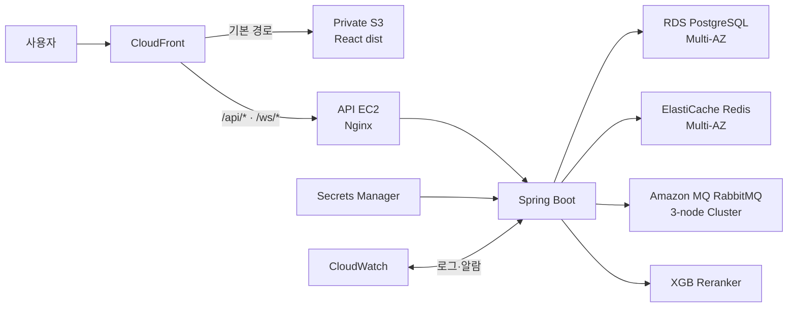

이 구조는 한 번에 전환하지 않고 RDS → Redis → RabbitMQ → Web 순서로 단계적으로 분리하는 것이 가장 안전합니다. Git 저장소와 로컬 개발용 `compose.yaml`은 유지하고, 운영 배포만 나눕니다.

## 목표 구조



운영 서버의 최종 Compose에는 다음만 남깁니다.

```text
compose.api.prod.yaml
├── nginx
├── api
└── xgb-reranker
```

PostgreSQL, Redis, RabbitMQ, Web은 Compose에서 제거합니다. 로컬 개발용 [compose.yaml](/Users/juhoseok/Desktop/prototype/compose.yaml)은 그대로 유지합니다.

## 데이터 보존 정책

- 기존 PostgreSQL 사용자 데이터는 보존하지 않고 새 RDS를 Flyway와 seed로 초기화한다.
- 기존 Redis key와 RabbitMQ 메시지는 보존하지 않는다.
- `recommendation-models`의 기존 XGB 모델과 `agent-log-data`의 PC Agent 로그도 보존하지 않는다.
- API Key, OAuth Secret, JWT Secret 등 `.env.prod`의 비밀값도 반드시 보존하고 Secrets Manager로 옮긴다.
- 분리 후 XGB reranker를 활성화하려면 기존 모델 복원이 아니라 새 모델 artifact 배포 또는 재학습 절차를 별도로 마련한다.

## Phase 0. 구현 전 확정 및 현황 기록

실제 실행 순서와 현재 기준선은 [aws-infrastructure-phase-0-runbook.md](/Users/juhoseok/Desktop/prototype/docs/aws-infrastructure-phase-0-runbook.md)에 기록합니다. AWS Management Console 조작과 운영 EC2 명령 실행은 사용자가 수행하고, 저장소 분석·로컬 검증·결과 문서화는 Codex가 지원합니다.

먼저 아래 내용을 기록합니다.

- 현재 CloudFront Distribution ID와 Origin 설정
- Flyway로 새 DB의 스키마와 seed를 재생성할 수 있는지 확인
- RabbitMQ exchange, queue, routing key가 코드에서 자동 선언되는지 확인
- EC2의 Docker Volume과 환경 변수
- 현재 배포 버전과 Git SHA
- `.env.prod`의 비밀값이 유실되지 않도록 현재 파일을 유지하고 Secrets Manager 이전 대상을 확정
- 현재 [compose.prod.yaml](/Users/juhoseok/Desktop/prototype/compose.prod.yaml) 렌더링 결과

이 단계에서는 기존 서비스를 변경하지 않습니다.

### 산출물:

- 현재 설정 목록
- 롤백 기준 버전
- Secrets Manager 이전 대상 목록
- 전환 시간 및 담당자

## Phase 1. 테스트를 먼저 작성

프로젝트 규칙에 따라 설정을 수정하기 전에 검증 코드를 먼저 준비합니다.

테스트 코드, 실행 명령, 현재 실패 기준선은 [aws-infrastructure-phase-1-tests.md](/Users/juhoseok/Desktop/prototype/docs/aws-infrastructure-phase-1-tests.md)에 기록합니다.

### 정적 검증

- `compose.api.prod.yaml`에 `web`, `postgres`, `redis`, `rabbitmq`가 없는지 검사
- 운영 환경에서 DB·Redis·RabbitMQ 포트를 외부에 공개하지 않는지 검사
- Nginx 설정의 `nginx -t`
- Spring Boot가 관리형 endpoint 환경 변수를 읽는지 검사
- RabbitMQ TLS `5671` 설정 검사
- Redis TLS 및 인증 설정 검사
- CloudFront `/api/*` 캐시 비활성 설정 검사

### 통합 테스트

- RDS 연결 및 Flyway 실행
- `SELECT extversion FROM pg_extension WHERE extname='vector'`
- ElastiCache 읽기·쓰기·TTL
- OAuth one-time code 저장 및 1회 소비
- WebSocket ticket 발급 및 소비
- Amazon MQ publish/consume
- RabbitMQ 연결 종료 후 재연결
- XGB reranker의 RDS 연결

### 배포 후 스모크 테스트

- `/api/health`
- 로그인·토큰 갱신·로그아웃
- Google OAuth callback
- 부품 목록과 견적 저장
- Build Chat Redis cache
- Agent RabbitMQ job
- `/ws/*` WebSocket 연결
- RAG vector 검색
- XGB reranker 요청
- PC Agent 로그 업로드

## Phase 2. 네트워크와 보안 구성

현재 VPC에는 퍼블릭 서브넷만 있으므로 관리형 서비스를 위한 Private Data Subnet을 추가합니다.

### 예시:

```text
10.0.32.0/24 → ap-northeast-2a
10.0.33.0/24 → ap-northeast-2b
추가 AZ 서브넷 → Amazon MQ Cluster용
```

### 보안 그룹:

| 보안 그룹 | 인바운드 |
| --- | --- |
| API EC2 SG | CloudFront Origin 트래픽만 Nginx 포트에 허용 |
| RDS SG | API EC2 SG에서 5432만 허용 |
| Redis SG | API EC2 SG에서 6379만 허용 |
| RabbitMQ SG | API EC2 SG에서 5671만 허용 |

### 추가 작업:

- AWS 인프라 리소스는 Terraform이 아닌 AWS Management Console에서 수동 생성
- 콘솔에서 생성한 리소스 이름, ID, ARN, endpoint, 보안 그룹 규칙을 문서에 기록
- SSH `0.0.0.0/0` 규칙 제거
- EC2 접속은 Systems Manager Session Manager 사용
- EC2 Instance Role 추가
- Secrets Manager 읽기 권한 추가
- CloudWatch Agent 설치
- API EC2의 주소가 변하지 않도록 Elastic IP 사용
- PostgreSQL, Redis, RabbitMQ는 Public access 비활성화

## Phase 3. RDS부터 분리

가장 중요한 데이터베이스를 먼저 독립시킵니다. 이 단계에서는 Web, Redis, RabbitMQ는 기존 구성을 유지합니다.

### RDS 생성

- RDS PostgreSQL 16
- Multi-AZ
- Private DB Subnet Group
- Public access 비활성
- 자동 백업 및 삭제 보호
- 스토리지 자동 확장
- `vector` 확장 활성화
- API runtime 사용자와 migration 사용자 분리
- 비밀번호는 Secrets Manager 저장

### 신규 DB 초기화 리허설

- 빈 테스트 RDS에 API migration 사용자를 연결
- Flyway 전체 migration 실행
- `vector`, `pgcrypto` 확장과 Flyway history 확인
- migration에 포함된 부품·RAG·관리자용 seed 생성 확인
- Flyway에서 만들지 않는 RAG embedding backfill 실행
- 새 XGB 모델 artifact를 배포하거나 reranker를 비활성 상태로 유지
- API를 테스트 RDS에 연결하여 E2E 수행

### 운영 전환

기존 PostgreSQL 데이터는 이전하지 않는다. AWS DMS, `pg_dump`, `pg_restore`, row count 비교, DB 쓰기 중단은 수행하지 않는다.

- 빈 RDS에 Flyway migration과 seed 적용
- RAG embedding backfill 실행
- seed 데이터와 vector 검색 검증
- API의 datasource를 RDS endpoint로 변경
- API 재기동
- 스모크 테스트

기존 PostgreSQL 컨테이너는 RDS 전환 검증이 끝날 때까지 중지만 유지하고, 안정화 후 Volume과 함께 제거한다.

## Phase 4. ElastiCache Redis 분리

기존 Redis 데이터는 보존하지 않고 빈 ElastiCache를 사용합니다. 기존 로그인 임시 코드, WebSocket ticket, 캐시는 모두 초기화됩니다.

### 구성:

- Redis 복제 그룹
- Primary + Replica
- Multi-AZ 자동 장애조치
- Private Subnet
- TLS 활성화
- 인증 사용자 구성
- API SG에서만 접근

### 전환 순서:

- ElastiCache 연결 테스트
- Spring Redis TLS 설정 적용
- API endpoint 변경
- 필요하면 캐시 prewarm 실행
- OAuth code, WebSocket ticket 테스트
- 기존 Redis 컨테이너 중지
- 로그인·OAuth·WS 회귀 테스트

Redis 데이터 이전이나 key·TTL 비교는 수행하지 않는다.

## Phase 5. Amazon MQ RabbitMQ 분리

Amazon MQ는 RabbitMQ Cluster 배포를 사용합니다.

### 구성:

- 3-node RabbitMQ Cluster
- Private access
- AMQPS `5671`
- CloudWatch 로그
- Queue depth 알람
- API SG만 접근
- Secrets Manager 인증정보

### 전환 순서:

- Amazon MQ를 빈 Broker로 시작
- API 시작 시 코드가 exchange, queue, binding을 자동 생성하는지 확인
- 테스트 메시지 publish/consume
- Worker 중지
- endpoint를 Amazon MQ로 변경
- TLS 활성화
- Worker 재시작
- 새 Queue publish/consume 확인
- 기존 RabbitMQ 컨테이너 중지

기존 RabbitMQ 메시지는 이전하지 않으므로 Queue drain이나 메시지 발행 중단 대기는 수행하지 않는다.

RabbitMQ 연결은 유지보수나 노드 전환 때 끊길 수 있으므로 Spring Client의 자동 재연결을 반드시 검증합니다.

## Phase 6. API 전용 Compose로 전환

기존 [compose.prod.yaml](/Users/juhoseok/Desktop/prototype/compose.prod.yaml)을 직접 없애기보다 새 파일을 먼저 추가합니다.

```text
compose.api.prod.yaml
├── nginx
├── api
└── xgb-reranker
```

### 주요 변경:

- `postgres`, `redis`, `rabbitmq`, `mailpit`, `web` 제거
- 인프라 서비스에 대한 `depends_on` 제거
- `build` 대신 ECR의 버전 고정 이미지 사용
- API와 XGB 모두 RDS endpoint 사용
- Nginx는 정적 파일 제공 기능을 제거하고 API/WS 프록시만 담당
- `latest` 대신 Git SHA 태그 사용
- Secrets Manager 값을 배포 시점에 주입
- 기존 PostgreSQL, Redis, RabbitMQ, `recommendation-models`, `agent-log-data` Volume은 전체 전환 검증 후 삭제 가능
- 새 XGB 모델이 준비되지 않았다면 `RECOMMENDATION_RERANKER_ENABLED=false`를 유지

안정화가 끝나기 전에는 문제 분석을 위해 기존 Volume을 삭제하지 않는다. 안정화 완료 후에만 `docker compose down -v` 또는 개별 Volume 삭제 여부를 결정한다.

API Nginx 설정은 현재 [default.conf](/Users/juhoseok/Desktop/prototype/infra/nginx/default.conf)에서 정적 Web 제공 부분과 API 프록시 부분을 분리해야 합니다.

## Phase 7. S3와 CloudFront로 Web 이전

### S3

- React 빌드 결과 `apps/web/dist` 업로드
- S3 Public access 전체 차단
- CloudFront OAC만 읽기 허용
- 해시 정적 자산은 장기 캐시
- `index.html`은 `no-cache`

### CloudFront

| 경로 | Origin | 정책 |
| --- | --- | --- |
| `*` | S3 | 정적 캐시 |
| `/api/*` | API EC2 Nginx | 캐시 비활성 |
| `/ws/*` | API EC2 Nginx | WebSocket 전달 |

CloudFront는 중간에 ALB를 두지 않고 Elastic IP가 연결된 API EC2의 Public DNS를 Origin으로 사용해 Nginx에 직접 연결합니다.

`/api/*`에는 다음이 전달되어야 합니다.

- 모든 HTTP method
- Authorization
- Origin
- Cookies
- Query string

SPA fallback은 전체 Distribution의 404를 `index.html`로 바꾸면 API 404까지 가려질 수 있습니다. 따라서 기본 S3 동작에만 CloudFront Function 등을 적용하여 확장자 없는 Web route를 `index.html`로 처리하는 편이 안전합니다.

## Phase 8. CI/CD 분리

현재 [deploy-compose.yml](/Users/juhoseok/Desktop/prototype/.github/workflows/deploy-compose.yml)은 Web과 API를 동시에 빌드해 EC2에 전체 저장소를 복사합니다. 이를 세 파이프라인으로 나눕니다.

### Web 배포

```text
apps/web 변경
→ npm test
→ npm run build
→ S3 sync
→ index.html CloudFront invalidation
```

### API 배포

```text
apps/api 또는 API Nginx 변경
→ Gradle test
→ bootJar
→ Docker image build
→ ECR push :git-sha
→ EC2에서 compose pull/up
→ /api/health 확인
→ 실패 시 이전 SHA로 롤백
```

### XGB 배포

```text
XGB 코드 변경
→ 테스트
→ 이미지 빌드
→ ECR push
→ xgb-reranker만 재배포
```

장기적으로는 SSH key를 GitHub Secrets에 저장하는 현재 방식 대신 다음을 사용합니다.

```text
GitHub OIDC
→ AWS IAM Role
→ ECR/S3/CloudFront
→ SSM SendCommand로 EC2 배포
```

## Phase 9. 최종 전환 및 검증

한 번에 전체 Origin을 바꾸지 않고 다음 순서로 전환합니다.

1. 현재 API가 RDS를 사용하도록 전환
2. Redis를 ElastiCache로 전환
3. RabbitMQ를 Amazon MQ로 전환
4. API 전용 Compose로 전환
5. S3 Web Origin 구성
6. CloudFront `/api/*`, `/ws/*` Origin 구성
7. CloudFront 기본 Origin을 S3로 변경
8. 전체 E2E 검증
9. CloudWatch 지표 확인
10. 기존 컨테이너는 안정화 기간 후 제거

### 완료 기준:

- CloudFront 도메인에서 Web route 새로고침 성공
- `/api/*` 응답이 캐시되지 않음
- `/ws/*` 연결과 인증 성공
- RDS·Redis·RabbitMQ가 외부에 공개되지 않음
- 운영 Compose에 `nginx`, `api`, `xgb-reranker`만 존재
- Web/API를 독립적으로 배포할 수 있음
- 비LLM API p95 500ms 목표 충족
- API 재배포 중 RDS·Redis·RabbitMQ가 중단되지 않음
- 이전 버전 롤백 성공

## 롤백 계획

- Web 문제: CloudFront 기본 Origin을 기존 EC2로 복구
- API 문제: ECR 이전 SHA 이미지로 재배포
- Redis 문제: endpoint를 기존 Redis로 되돌리고 API 재기동
- RabbitMQ 문제: 발행을 중지하고 기존 Broker로 endpoint 복구
- RDS 문제: endpoint를 기존 PostgreSQL로 일시 복구하거나 빈 RDS를 다시 생성하고 Flyway·seed를 재실행

PostgreSQL·Redis·RabbitMQ·XGB 모델·PC Agent 로그의 기존 데이터는 롤백 대상이 아니다. 롤백은 서비스 연결과 코드 배포 버전에 대해서만 보장한다.

## 예상 일정

| 단계 | 예상 |
| --- | --- |
| 기준선·테스트 작성 | 1일 |
| 네트워크·관리형 서비스 구성 | 1~2일 |
| RDS 초기화 및 검증 | 1일 |
| Redis·RabbitMQ 전환 | 1일 |
| API Compose·CI/CD 분리 | 1~2일 |
| S3·CloudFront 전환 | 1일 |
| E2E·부하·롤백 검증 | 1일 |
| 총 예상 | 7~9일 |

현재 [aws-deployment-strategy.md](/Users/juhoseok/Desktop/prototype/docs/aws-deployment-strategy.md)는 ECS Fargate와 비용 최적화를 전제로 작성되어 있어, 이번에 확정한 API EC2 + RDS Multi-AZ + ElastiCache Multi-AZ + Amazon MQ Cluster + AWS 콘솔 수동 생성 결정에 맞게 함께 수정해야 합니다.

## 확정 사항

1. CloudFront에서 중간 ALB 없이 API EC2 Nginx로 직접 연결
2. 기존 PostgreSQL·Redis·RabbitMQ 데이터는 폐기하고 새 관리형 서비스에서 초기화
3. AWS 인프라는 Terraform이 아닌 AWS Management Console에서 수동 생성
4. PostgreSQL·Redis·RabbitMQ·XGB 모델·PC Agent 로그의 기존 데이터는 모두 폐기 가능
5. `.env.prod`의 비밀값은 유지하고 Secrets Manager로 이전
